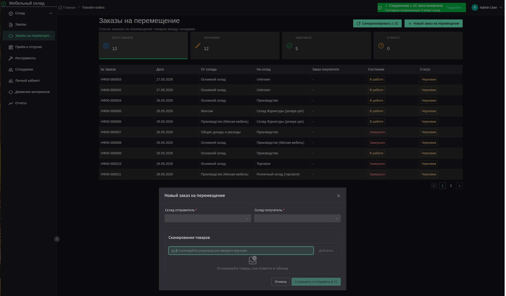

# Полное Руководство Пользователя

## Складская Система Управления (WMS)

> 📄 **PDF-версия:** Для удобства чтения и печати доступна [PDF-версия руководства](docs/USER_MANUAL.pdf).
> 
> 🖼️ **Скриншоты:** Все скриншоты находятся в папке `docs/screenshots/`.

---

## Содержание

### Общие разделы
1. [Введение](#1-введение)
2. [Авторизация и доступ](#2-авторизация-и-доступ)
3. [Профиль пользователя](#3-профиль-пользователя)

### Страницы системы
4. [Главная страница](#4-главная-страница)
5. [Склад ТМЦ](#5-склад-тмц)
6. [Готовая продукция](#6-готовая-продукция)
7. [Заказы покупателей](#7-заказы-покупателей)
8. [Отгрузка (сканирование QR)](#8-отгрузка-сканирование-qr)
9. [Заказы на перемещение](#9-заказы-на-перемещение)
10. [Учёт инструментов](#10-учёт-инструментов)
11. [Сотрудники](#11-сотрудники)
12. [Отчёты](#12-отчёты)

### Приложения
- [Приложение А. Логика работы с QR-кодами](#приложение-а-логика-работы-с-qr-кодами)
- [Приложение Б. Печать штрихкодов и QR-кодов](#приложение-б-печать-штрихкодов-и-qr-кодов)
- [Приложение В. Горячие клавиши](#приложение-в-горячие-клавиши)
- [Приложение Г. Устранение неполадок](#приложение-г-устранение-неполадок)

---

## 1. Введение

Система предназначена для управления складскими операциями: учёт материалов, готовой продукции, заказов, инструментов и персонала. Интегрирована с 1С для синхронизации номенклатуры, заказов и остатков.

### Роли пользователей

| Роль         | Описание      | Доступные функции                               |
|--------------|---------------|-------------------------------------------------|
| **admin**    | Администратор | Полный доступ: сотрудники, цены, настройки      |
| **manager**  | Менеджер      | Заказы, материалы, отчёты, цены                 |
| **worker**   | Рабочий       | Просмотр, сканирование, базовые операции        |
| **warehouse**| Кладовщик     | Склад, отгрузка, перемещения, сканирование      |
| **production**| Производство | Готовая продукция, сканирование, перемещение    |

---

## 2. Авторизация и доступ

### Вход в систему


*Рисунок 16 — Страница входа в систему*

1. Откройте приложение в браузере по адресу, предоставленному администратором.
2. Введите логин и пароль.
3. Нажмите кнопку **«Войти»**.

### Первый вход сотрудника

- При создании учётной записи генерируется временный пароль.
- После первого входа система рекомендует сменить пароль в разделе **Профиль**.

### Восстановление доступа

- Обратитесь к администратору для сброса пароля.
- Администратор может изменить учётные данные в разделе **Сотрудники → Изменить учётные данные**.

---

## 3. Профиль пользователя


*Рисунок 17 — Страница профиля текущего пользователя*

Раздел для управления личными данными. Доступен из меню пользователя в правом верхнем углу.

| Функция           | Описание                   |
|-------------------|----------------------------|
| **Изменить пароль** | Смена текущего пароля     |
| **Обновить фото**   | Загрузка аватара          |
| **Контакты**        | Редактирование email и телефона |

---

## 4. Главная страница


*Рисунок 1 — Главная страница с дашбордом*

Главная страница представляет собой дашборд с быстрым доступом к основным разделам.

| Карточка                     | Описание                                   | Переход          |
|------------------------------|--------------------------------------------|------------------|
| 📊 **Управление складом**    | Просмотр и управление материалами и товарами | `/inventory`     |
| 📋 **Заказы**                | Создание и отслеживание заказов клиентов     | `/orders`        |
| 👥 **Сотрудники**            | Управление персоналом предприятия            | `/employees`     |

При загрузке страницы автоматически восстанавливаются данные из локального хранилища (localStorage) для работы в офлайн-режиме.

---

## 5. Склад ТМЦ


*Рисунок 2 — Страница управления материалами и запасами*

Страница **«Склад ТМЦ»** предназначена для управления материалами и запасами.

### 5.1. Статистические карточки

| Карточка              | Значение                                 | Действие при клике        |
|-----------------------|------------------------------------------|---------------------------|
| **Всего позиций**     | Общее количество SKU                     | Сброс фильтров            |
| **Отсутствует**       | Позиции со статусом «Отсутствует»        | Фильтр по статусу         |
| **Зарезервировано**   | Количество зарезервированных единиц      | Фильтр по резерву         |
| **В наличии (SKU)**   | Позиции со статусом «В наличии»          | Фильтр по наличию         |
| **Стоимость запасов** | Общая стоимость всех запасов             | —                         |

### 5.2. Фильтры и поиск

| Элемент     | Описание                                                     |
|-------------|--------------------------------------------------------------|
| **Категория**| Фильтр по категориям номенклатуры из 1С                      |
| **Склад**   | Фильтр по складам                                            |
| **Статус**  | Фильтр: В наличии / Мало / Отсутствует / Зарезервировано / В пути / Заблокировано |
| **Поиск**   | Поиск по названию, артикулу (SKU) или штрихкоду              |

### 5.3. Таблица материалов

| Колонка           | Описание                                                   |
|-------------------|------------------------------------------------------------|
| **Материал**      | Название + изображение                                     |
| **Резерв под заказы** | Список заказов, под которыми зарезервирован товар        |
| **Остаток**       | Доступное количество / Всего на складе / Резерв / В пути   |
| **Цена за ед.**   | Средняя цена (скрыто для рабочих)                          |
| **Статус**        | Цветной тег статуса                                        |
| **Склад**         | Название склада                                            |
| **Место хранения**| Ячейка/полка (storageBin)                                  |
| **Стоимость**     | Общая стоимость позиции (скрыто для рабочих)               |

### 5.4. Действия

| Действие              | Описание                                                   |
|-----------------------|------------------------------------------------------------|
| **Синхронизация с 1С**| Загрузка актуальных остатков и номенклатуры из 1С          |
| **Новый материал**    | Создание новой карточки материала                          |
| **Excel**             | Экспорт отфильтрованных данных в Excel                     |
| **PDF**               | Экспорт отфильтрованных данных в PDF                       |
| **Клик по строке**    | Открытие карточки материала для редактирования             |

### 5.5. Карточка материала


*Рисунок 11 — Модальное окно карточки материала*

| Поле             | Описание                                           |
|------------------|----------------------------------------------------|
| Название         | Наименование материала                             |
| Артикул (SKU)    | Уникальный код из 1С                               |
| Штрихкод         | Локальный штрихкод (генерируется автоматически)    |
| Категория        | Категория номенклатуры из 1С                       |
| Ед. измерения    | шт, м, м², кг и др.                                |
| Склад            | Склад хранения                                     |
| Место хранения   | Полка/ячейка (только локально)                     |
| Остаток          | Текущий остаток                                    |
| Мин./Макс. запас | Пороговые значения                                 |
| Резерв           | Зарезервированное количество                       |
| Статус           | Автоматически рассчитывается по остаткам           |
| Изображение      | Фото материала                                     |

---

## 6. Готовая продукция


*Рисунок 3 — Страница готовой продукции*

Раздел аналогичен **Складу ТМЦ**, но отображает только изделия (продукцию собственного производства) с `categoryId = '99'`.

### Особенности

- Автоматическая генерация штрихкода в формате `PRD-YY-XXXXXX`.
- Автоматическое заполнение: SKU = штрихкод, место = `FG-ZONE`, категория = `99`.
- Поле **«Поставщик»** = «Собственное производство».
- Отображение прогресса отгрузки по заказам.

### Таблица готовой продукции

| Колонка           | Описание                                                   |
|-------------------|------------------------------------------------------------|
| **Изделие**       | Название + изображение                                     |
| **Резерв под заказы** | Список заказов, под которыми зарезервировано изделие    |
| **Остаток**       | Доступное количество / Всего на складе / Резерв            |
| **Статус**        | Цветной тег статуса                                        |
| **Место хранения**| Ячейка/полка (storageBin) — по умолчанию `FG-ZONE`         |
| **Действия**      | Печать штрихкода, редактирование                           |

---

## 7. Заказы покупателей


*Рисунок 4 — Страница управления заказами клиентов*

Страница **«Заказы покупателей»** предназначена для управления заказами клиентов и генерации QR-кодов.

### 7.1. Статистика

| Карточка           | Описание                                     |
|--------------------|----------------------------------------------|
| **Всего заказов**  | Общее количество заказов                     |
| **В работе**       | Заказы в производстве                        |
| **На складе**      | Заказы, готовые к отгрузке                   |
| **Отгружен**       | Уже отгруженные заказы                       |
| **Стоимость заказов** | Сумма заказов в работе (скрыто для рабочих) |

### 7.2. Таблица заказов

| Колонка     | Описание                                                |
|-------------|---------------------------------------------------------|
| **Номер**   | Номер заказа покупателя                                 |
| **Клиент**  | Наименование контрагента                                |
| **Дата**    | Дата заказа                                             |
| **Выполнено**| Прогресс QR-кодов: отсканировано/сгенерировано         |
| **Статус**  | В работе / На складе / Отгружен                         |
| **Сумма**   | Общая сумма заказа                                      |
| **QR Коды** | Кнопка управления QR-кодами заказа                      |
| **Действия**| Просмотр деталей заказа                                 |

### 7.3. QR-коды заказа


*Рисунок 12 — Модальное окно управления QR-кодами заказа*

При нажатии кнопки **QR** открывается модальное окно управления QR-кодами:

| Функция                 | Описание                                                    |
|-------------------------|-------------------------------------------------------------|
| **Сгенерировать все**   | Автоматическая генерация QR-кодов для всех позиций заказа   |
| **Печать всех**         | Печать всех QR-кодов заказа                                 |
| **Печать последних**    | Печать последних сгенерированных кодов                      |
| **Генерация с параметрами** | Выбор изделия, количества, доп. информации             |
| **Упаковочный код**     | Генерация QR-кода для упаковки (объединяет несколько изделий) |

### Статусы QR-кодов

| Статус       | Значение                                               |
|--------------|--------------------------------------------------------|
| **Создан**   | QR-код сгенерирован, но ещё не напечатан               |
| **Распечатан**| QR-код отправлен на печать                            |
| **На складе**| Изделие принято на склад (первое сканирование)         |
| **Отгружен** | Изделие отгружено клиенту (второе сканирование)        |

### 7.4. Детали заказа


*Рисунок 18 — Детальная информация о заказе*

При клике на заказ открывается детальная информация:
- Состав заказа (позиции, количества, цены)
- Прогресс выполнения по QR-кодам
- История сканирований
- Кнопки действий: печать QR, отгрузка

---

## 8. Отгрузка (сканирование QR)


*Рисунок 5 — Рабочее место кладовщика для сканирования QR-кодов*

Страница **«Отгрузка»** — ключевой рабочий интерфейс для кладовщика.

### 8.1. Поле сканирования

- Введите или отсканируйте QR-код в поле ввода и нажмите **Enter**.
- Большинство сканеров автоматически отправляют Enter после кода — сканирование срабатывает мгновенно.
- Если сканер не шлёт Enter, нажмите Enter вручную.
- `isScanning` guard блокирует повторный вызов, пока предыдущее сканирование не завершится (предотвращает дубли).
- Поддерживается транслитерация русской раскладки (сканер вводит символы в текущей раскладке).

### 8.2. Логика сканирования

| Действие                  | Результат                                                     | Статус QR               |
|---------------------------|---------------------------------------------------------------|-------------------------|
| **Первое сканирование**   | Товар добавляется в список перемещения на склад готовой продукции | `generated` → `scanned` |
| **Повторное сканирование**| Товар добавляется в текущую отгрузку                          | `scanned` → `shipped`   |
| **Сканирование отгруженного** | Сообщение: «Товар уже отгружен»                           | `shipped` (без изменений) |
| **Сканирование неизвестного** | Сообщение об ошибке                                       | —                       |

### 8.3. Упаковочные коды и контроль комплектности

- Если позиция заказа имеет **упаковочные QR-коды**, отгрузка производится **только по упаковкам**.
- При сканировании детали позиции, у которой есть упаковки, выводится сообщение:
  ```
  ❌ Деталь нужно упаковать и переместить упаковку на склад, после чего её можно отгрузить.
  ```
  Деталь не добавляется в документ отгрузки.
- При приёмке на склад: сначала сканируются все детали, затем упаковка — порядок обязателен.

### 8.4. Реактивная валидация отгрузки

Система в реальном времени анализирует состав отгрузки и выводит информационное сообщение под полем сканирования:

| Тип сообщения | Пример |
|---------------|--------|
| **Успех** | `✓ заказ 24/2025: отгружается 1 упаковка, заказ будет отгружен полностью: Полка: 1/2 будет отгружена полностью` |
| **Предупреждение** | `⚠ заказ 24/2025: отгружается 1 деталь из 4, заказ будет отгружен не полностью: Стол: 1 деталь из 5` |
| **Инфо (приёмка)** | `К приёмке: заказ 24/2025: 3 из 10 шт.` |

**Логика подсчёта:**
- Для позиций с упаковочными кодами общее количество = только упаковки (детали не учитываются)
- Для позиций без упаковок = все QR-коды позиции
- Число «из N» показывает оставшиеся неотгруженные позиции, а не общее количество в заказе
- Если все оставшиеся позиции отсканированы — сообщение зелёное (успех), иначе — жёлтое (предупреждение)

**Правильные окончания:** система использует корректные формы слов:
- 1 деталь, 3 детали, 5 деталей
- 1 упаковка, 2 упаковки, 5 упаковок

### 8.5. Кнопки действий

| Кнопка                  | Условие отображения                 | Действие                                           |
|-------------------------|-------------------------------------|----------------------------------------------------|
| **Переместить на склад**| Есть товары с первым сканированием  | Перемещение на склад готовой продукции, обновление статуса QR |
| **Отгрузить**           | Есть товары с повторным сканированием| Финальная отгрузка, обновление статуса QR на `shipped` |
| **Очистить**            | Есть отсканированные товары         | Очистка текущей сессии                             |

### 8.6. Таблица состава отгрузки


*Рисунок 21 — Таблица состава текущей отгрузки*

| Колонка          | Описание                                               |
|------------------|--------------------------------------------------------|
| **QR код**       | Код товара                                             |
| **Название детали** | Наименование изделия                                |
| **Заказ покупателя** | Номер заказа                                        |
| **Количество**   | Количество позиций                                     |
| **Статус**       | ↻ Ожидает перемещения / ✓ На складе / ✓✓ К отгрузке  |
| **Действие**     | Удаление позиции из сессии                             |

### 8.7. История отгрузки

Отображает последние 5 завершённых отгрузок с указанием:
- Даты и времени
- Сотрудника, выполнившего отгрузку
- Количества товаров
- Номеров заказов

---

## 9. Движение материалов


*Рисунок 6 — Страница истории движения материалов*

Страница **«Движение материалов»** отображает все операции с материалами и готовой продукцией: поступление на склад, отгрузку клиентам, перемещение между складами и операции с инструментами.

  ### 9.1. Метрики (фильтры)

  ### 9.2. Фильтры

  ### 9.3. Типы операций

  ### 9.4. Таблица операций

  ### 9.5. Детали операции

  ### 9.6. Просмотр накладной

  ### 9.7. Источники данных

Страница объединяет данные из четырёх источников:
1. **Накладные материалов** (`material_invoices`) — поступление ТМЦ и готовой продукции
2. **История отгрузок** (`operation_logs`) — отгрузки QR-кодов
3. **Заказы на перемещение** (`transfer_orders`) — перемещение между складами
4. **Операции с инструментами** (`tool_operations`) — выдача/возврат инструментов

---

## 10. Заказы на перемещение


*Рисунок 10 — Страница заказов на перемещение между складами*

Раздел для работы с заказами на перемещение товаров между складами из 1С.

### 10.1. Статистические фильтры

Над таблицей расположены карточки быстрой фильтрации:

| Карточка       | Описание                                 | Действие при клике        |
|----------------|------------------------------------------|---------------------------|
| **Всего заказов** | Общее количество                     | Сброс фильтров            |
| **Черновики**  | Локальные заказы (не отправленные в 1С) | Фильтр по локальным заказам |
| **В работе (ячейки)** | Заказы со статусом «В работе (ячейки)» | Фильтр по статусу         |
| **В работе (списание)** | Заказы со статусом «В работе (к списанию)» | Фильтр по статусу         |
| **Завершено (ячейки)** | Заказы со статусом «Завершён (ячейки)» | Фильтр по завершённым     |
| **Завершено (списание)** | Заказы со статусом «Завершён (списание)» | Фильтр по завершённым     |

### 10.2. Таблица заказов

Включает выбор количества строк на странице: **10, 25, 50, 100** (выпадающий список «Показывать» над таблицей).

| Колонка               | Описание                        |
|-----------------------|---------------------------------|
| **№ Заказа**          | Номер документа перемещения     |
| **Дата**              | Дата создания                   |
| **От склада**         | Склад-отправитель               |
| **На склад**          | Склад-получатель                |
| **Заказ покупателя**  | Связанный заказ покупателя      |
| **Состояние**         | Статус заказа (Черновик / В работе (к списанию) / В работе (ячейки) / Завершён) |

### 10.3. Создание нового заказа



*Рисунок 6.1 — Модальное окно создания нового заказа на перемещение*

1. На странице списка заказов нажмите **«Новый заказ на перемещение»** (зелёная кнопка).
2. Выберите **склад-отправитель** и **склад-получатель** из выпадающих списков.
3. **Сканирование или поиск товара** — поле ввода поддерживает два режима:
   - **Сканирование штрихкода** — код распознаётся автоматически по символу конца строки от сканера, товар добавляется в таблицу без нажатия кнопок
   - **Поиск по названию** — начните вводить название товара (от 2 символов), появится выпадающий список с результатами поиска из базы 1С. Поиск **регистронезависимый**: `винт` найдёт и `Винт`, и `ВИНТ`. Клик по результату — товар добавляется в таблицу.
   - **Ручной ввод штрихкода** — введите код и нажмите Enter
   - Если штрихкод не найден в базе — товар **не добавляется** в таблицу, выводится предупреждение
4. При необходимости измените **количество** или удалите позиции.
5. Выберите один из вариантов:
   - **«Сохранить локально»** — заказ сохраняется как черновик (LOCAL-) для последующего редактирования
   - **«Сохранить и отправить в 1С»** — заказ сразу отправляется в 1С со статусом «В работе (к списанию)»

**Данные, передаваемые в 1С:**
- Дата перемещения
- Склад-отправитель и склад-получатель (ключи структурных единиц)
- Хозяйственная операция (автоматически определяется как «Перемещение»)
- Состав заказа: номенклатура, количество, единица измерения (GUID из классификатора единиц измерения)
- Статус: «В работе (к списанию)»

### 10.4. Локальные заказы (черновики)

Локальные заказы создаются, когда пользователь хочет подготовить заказ перед отправкой в 1С или когда 1С недоступна.

**Особенности локальных заказов:**
- Номер заказа начинается с префикса `LOCAL-`
- Статус отображается как **«Черновик»**
- Сохраняются в локальной базе данных
- **Не удаляются** при синхронизации с 1С
- Можно редактировать товары и количество
- Можно отправлять в 1С со статусом «В работе (к списанию)»

**Работа с локальным заказом:**
1. Откройте заказ из списка (клик по строке).
2. В поле **«Отсканируйте штрихкод»** можно:
   - Добавить новый товар (если его нет в заказе)
   - **Увеличить количество** товара на 1 при повторном сканировании того же штрихкода
3. Поле **«Количество»** поддерживает:
   - Ручной ввод целых чисел (например, `5`)
   - Ручной ввод дробных чисел через запятую или точку (например, `2,5` или `2.5`)
   - Изменение кнопками `+` и `−` (целые числа)
4. После подготовки нажмите **«Отправить в 1С»**:
   - Заказ отправляется в 1С со статусом **«В работе (к списанию)»**
   - Локальный номер заменяется на номер из 1С
   - Заказ появляется в общем списке со статусом «В работе»

**Важно:** Локальные заказы сохраняются при синхронизации с 1С и не удаляются. Вы можете создать заказ, добавить товары, сохранить локально, а позже вернуться и отправить в 1С. Вы можете создать заказ, добавить товары, сохранить локально, а позже вернуться и отправить в 1С. Вы можете создать заказ, добавить товары, сохранить локально, а позже вернуться и отправить в 1С. Вы можете создать заказ, добавить товары, сохранить локально, а позже вернуться и отправить в 1С. Вы можете создать заказ, добавить товары, сохранить локально, а позже вернуться и отправить в 1С.

### 10.5. Режим сканирования


*Рисунок 20 — Режим сканирования товаров при перемещении*

Режим сканирования доступен для заказов из 1С со статусом **«В работе (ячейки)»**.

1. Откройте заказ и нажмите **«Начать сканирование»** (или `Ctrl+S`).
2. Отсканируйте штрихкоды товаров.
3. Система автоматически сопоставляет штрихкод с позицией заказа.
4. Цветовая индикация:
   - 🟢 Зелёный — полностью отсканировано
   - 🟡 Жёлтый — отсканировано частично
   - 🔴 Красный — превышено количество

5. Поле **«Отсканировано»** поддерживает:
   - Ручной ввод целых чисел (например, `5`)
   - Ручной ввод дробных чисел через запятую или точку (например, `2,5` или `2.5`)
   - Изменение кнопками `+` и `−` (целые числа)

6. Нажмите **ESC** или **«Завершить сканирование»** для завершения.

### 10.6. Результаты сканирования

| Действие                | Описание                                                   |
|-------------------------|------------------------------------------------------------|
| **Сохранить локально**  | Сохранение результатов в локальную БД (если не всё отсканировано) |
| **Отправить в 1С**      | Отправка подтверждения в 1С (только если количества совпадают) |
| **Продолжить сканирование** | Возврат в режим сканирования                           |

**Примечание:** Поле «Отсканировано» поддерживает ввод дробных чисел через запятую или точку (например, `2,5` или `2.5`). Это позволяет учитывать частичные единицы измерения (например, 2,5 метра ткани).

**Примечание:** Поле «Отсканировано» поддерживает ввод дробных чисел через запятую или точку (например, `2,5` или `2.5`). Это позволяет учитывать частичные единицы измерения (например, 2,5 метра ткани).

**Примечание:** Поле «Отсканировано» поддерживает ввод дробных чисел через запятую или точку (например, `2,5` или `2.5`). Это позволяет учитывать частичные единицы измерения (например, 2,5 метра ткани).

**Примечание:** Поле «Отсканировано» поддерживает ввод дробных чисел через запятую или точку (например, `2,5` или `2.5`). Это позволяет учитывать частичные единицы измерения (например, 2,5 метра ткани).

---

## 11. Учёт инструментов


*Рисунок 11 — Страница учёта инструментального хозяйства*

Страница **«Учёт инструментов»** предназначена для контроля инструментального хозяйства.

### 11.1. Статистика

| Карточка           | Описание                                     |
|--------------------|----------------------------------------------|
| **Всего ед.**      | Общее количество инструментов                |
| **В наличии**      | Инструменты на складе                        |
| **Выдано**         | Инструменты у сотрудников                    |
| **В ремонте**      | Инструменты на ремонте                       |
| **Стоимость инстр.**| Общая стоимость (скрыто для рабочих)        |

### 11.2. Фильтры

| Фильтр      | Описание                                                   |
|-------------|------------------------------------------------------------|
| **Тип**     | Электро / Ручной / Измерительный / Оснастка / Тара         |
| **Статус**  | На складе / Выдано / В ремонте / Списано                   |
| **Поиск**   | По названию, инвентарному номеру, QR-коду или штрихкоду. Поддерживается транслитерация: если ввод в английской раскладке (например, `qwerty` вместо `йцукен`), поиск автоматически преобразует его в русский. |

### 11.3. Таблица инструментов

Включает выбор количества строк на странице: **10, 25, 50, 100** (выпадающий список «Показывать» над таблицей).

| Колонка        | Описание                                               |
|----------------|--------------------------------------------------------|
| **Инв. №**     | Инвентарный номер                                      |
| **Наименование** | Название инструмента                                 |
| **Тип**        | Электро / Ручной / Измерительный / Оснастка / Тара     |
| **Цена**       | Стоимость                                              |
| **Статус**     | На складе / Выдано / В ремонте / Списано               |
| **Где/У кого** | Место хранения или ФИО сотрудника                      |
| **Действия**   | Печать QR / Удаление                                   |

### 11.4. Карточка инструмента


*Рисунок 19 — Модальное окно карточки инструмента*

| Поле             | Описание                                           |
|------------------|----------------------------------------------------|
| Наименование     | Название                                           |
| Инвентарный номер| Уникальный номер                                   |
| Тип              | Категория инструмента                              |
| Статус           | Текущий статус                                     |
| Выдано           | ФИО сотрудника (если выдано)                       |
| Место хранения   | Ячейка на складе                                   |
| Цена             | Стоимость                                          |
| QR-код           | Автоматически генерируется                         |

### 11.5. Действия с инструментом

| Действие      | Описание                                              |
|---------------|-------------------------------------------------------|
| **Выдать**    | Закрепление инструмента за сотрудником                |
| **Вернуть**   | Возврат инструмента на склад                          |
| **В ремонт**  | Отправка на ремонт                                    |
| **Списать**   | Списание с баланса                                    |
| **Печать QR** | Печать этикетки с QR-кодом для маркировки             |

### 11.6. Автоматическое логирование операций

При выдаче или возврате инструмента система автоматически создаёт запись в таблице `tool_operations`. Эти записи отображаются:
- На странице **«Движение материалов»** как операции «Выдан инструмент» / «Возврат инструмента»
- В **истории операций сотрудника** на вкладке «История операций»
- На странице **«Учёт инструментов»** (статус меняется автоматически)

---

## 12. Сотрудники


*Рисунок 12 — Страница управления персоналом*

Страница **«Сотрудники»** предназначена для управления персоналом предприятия.

### 12.1. Статистика

| Карточка         | Описание                                     |
|------------------|----------------------------------------------|
| **Всего сотр.**  | Общее количество сотрудников                 |
| **Активных**     | Сотрудники со статусом «Активен»             |
| **Рабочих**      | Сотрудники с ролью «Рабочий»                 |
| **В отпуске**    | Сотрудники в отпуске                         |
| **ФОТ в месяц**  | Фонд оплаты труда (скрыто для рабочих)       |

### 12.2. Фильтры

| Фильтр      | Описание                                                   |
|-------------|------------------------------------------------------------|
| **Отдел**   | Фильтр по подразделениям                                   |
| **Статус**  | Активен / Неактивен / Отпуск / Больничный                  |
| **Должность** | Администратор / Менеджер / Рабочий / Кладовщик / Производство |
| **Поиск**   | По имени, email, телефону                                  |

### 12.3. Режимы отображения

- **Список** — таблица с детальной информацией.
- **Плитки** — карточки с фото и основными данными.

### 12.4. Таблица сотрудников

| Колонка        | Описание                                               |
|----------------|--------------------------------------------------------|
| **ФИО**        | Полное имя сотрудника                                  |
| **Должность**  | Занимаемая должность                                   |
| **Отдел**      | Подразделение                                          |
| **Роль**       | Роль в системе (admin, manager, worker, и т.д.)        |
| **Статус**     | Активен / Неактивен / Отпуск / Больничный              |
| **Контакты**   | Email и телефон                                        |
| **Действия**   | Просмотр профиля / Редактировать / Удалить             |

### 12.5. Действия

| Действие                  | Доступ | Описание                               |
|---------------------------|--------|----------------------------------------|
| **Добавить сотрудника**   | Только admin | Создание новой учётной записи    |
| **Просмотр профиля**      | Все    | Полная анкета сотрудника               |
| **Inline-просмотр**       | Все    | Быстрый просмотр без перехода на отдельную страницу (открывается на той же странице) |
| **Редактировать**         | admin  | Изменение данных                       |
| **Изменить учётные данные** | admin | Смена логина/пароля                 |
| **Удалить**               | admin  | Удаление сотрудника                    |

### 12.6. Профиль сотрудника


*Рисунок 15 — Карточка профиля сотрудника*

При клике на сотрудника открывается inline-панель с вкладками:

**Вкладка «Инструменты»:**
- Таблица выданных инструментов с колонками: Инструмент, Инв. номер, Дата выдачи, Статус, Действия
- Кнопка «Сдать» для возврата инструмента на склад

**Вкладка «История операций»:**
- Временная шкала последних 10 операций сотрудника
- Отображаются все типы операций:
  - Сканирование QR-кодов (генерация, сканирование, отгрузка)
  - Создание и завершение заказов на перемещение
  - Выдача и возврат инструментов
  - Поступление и отгрузка материалов
- Для каждой операции показаны: иконка, тип, дата, номер заказа, товар, QR-код
- Кнопка обновления списка

---

## 13. Отчёты


*Рисунок 13 — Страница отчётов*

Раздел **«Отчёты»** предоставляет сводную аналитику и детальные отчёты по различным направлениям работы склада.

### 13.1. Главная — сводка по складу

Вкладка «Главная» отображает панель с карточками метрик, дающими моментальный срез состояния склада:

| Метрика         | Описание                                            |
|-----------------|-----------------------------------------------------|
| **Всего ТМЦ**   | Общее количество позиций ТМЦ на складе              |
| **Гот. продукция** | Количество позиций готовой продукции             |
| **Заказы**      | Количество заказов покупателей                      |
| **Резерв**      | Общий зарезервированный объём                       |
| **Рабочие**     | Количество рабочих в системе                        |
| **Сотрудники**  | Общее количество сотрудников                        |
| **Инструменты** | Общее количество инструментов в системе             |
| **Перемещения** | Количество незавершённых перемещений                |

### 13.2. Резерв по заказам — бронирование


*Рисунок 14 — Отчёт по резервам заказов*

Вкладка показывает, какие материалы зарезервированы под конкретные заказы. Позволяет:
- Сгруппировать данные по материалу или заказу
- Просмотреть количество, статус резерва, дату резервирования
- Отфильтровать по статусу (Активен / Снят / Отгружен)
- Искать и сортировать по любому столбцу

### 13.3. Производство — отчёт по продукции

Вкладка отображает информацию о произведённой продукции:

| Колонка            | Описание                                              |
|--------------------|-------------------------------------------------------|
| **Код продукции**  | Уникальный код                                        |
| **Наименование**   | Название продукции                                    |
| **План (шт.)**     | Запланированное количество                            |
| **Факт (шт.)**     | Фактически произведённое количество                   |
| **Статус**         | Статус производства                                   |
| **Дата изготовления** | Дата выпуска                                       |

### 13.4. Инструменты — отчёт по инструментам

Вкладка предоставляет сводную информацию по инструментальному хозяйству:

| Метрика           | Описание                                            |
|-------------------|-----------------------------------------------------|
| **Всего ед.**     | Всего инструментов в системе                        |
| **На складе**     | Количество в наличии на складе                      |
| **Выдано**        | Выдано сотрудникам                                  |
| **В ремонте**     | Находится в ремонте                                 |
| **Списано**       | Списано с баланса                                   |

**Вкладки таблицы:**
- «В наличии» — инструменты со статусом «на складе»; показывается ячейка хранения
- «Выданные» — инструменты у сотрудников; показывается ФИО сотрудника
- «В ремонте» — инструменты на ремонте
- «Все» — полный перечень

Каждая вкладка содержит таблицу с колонками: Инв. №, Наименование, Тип, Статус, Где/У кого. Доступна сортировка и поиск по наименованию.


*Рисунок 10 — Страница формирования отчётов*

Раздел формирования отчётов по складским операциям.

### Доступные отчёты

| Отчёт               | Описание                                       |
|---------------------|------------------------------------------------|
| **Остатки на складе** | Текущие остатки по всем позициям             |
| **Движение товаров**  | История прихода и расхода                    |
| **Резервы**           | Зарезервированные товары по заказам          |
| **История цен**       | Изменение цен по позициям                    |

### Фильтры отчётов

| Фильтр        | Описание                                            |
|---------------|-----------------------------------------------------|
| **Период**    | Дата начала и дата окончания                        |
| **Склад**     | Конкретный склад или все склады                     |
| **Категория** | Категория номенклатуры                              |
| **Статус**    | Статус документов (проведён / черновик)             |

### Экспорт отчётов

| Формат | Описание                                               |
|--------|--------------------------------------------------------|
| **Excel** | Выгрузка данных в формате `.xlsx` для дальнейшей обработки |
| **PDF**   | Печать отчёта в формате `.pdf`                       |

---

## Приложение А. Логика работы с QR-кодами

### А.1. Жизненный цикл QR-кода

```
generated (Создан)
    ↓  [Печать]
printed (Распечатан)
    ↓  [Первое сканирование на странице «Поступление на склад»]
scanned (На складе)
    ↓  [Второе сканирование на странице «Отгрузка»]
shipped (Отгружен)
```

### А.2. Первое сканирование — Поступление на склад

**Условия:**
- QR-код должен существовать в базе.
- Статус QR-кода должен быть `generated` (или `printed`).
- Товар ещё не был принят на склад.

**Результат:**
- Товар добавляется в список «Ожидает перемещения».
- Кладовщик нажимает кнопку **«Переместить на склад»**.
- Система отправляет запрос на бэкенд:
  - Создаётся запись о поступлении готовой продукции.
  - Статус QR-кода меняется на `scanned`.
  - Фиксируется время и сотрудник.
- Товар учитывается на складе готовой продукции.

### А.3. Второе сканирование — Отгрузка со склада

**Условия:**
- QR-код уже имеет статус `scanned` (находится на складе).
- Товар отсканирован повторно в текущей сессии.

**Результат:**
- Товар добавляется в список «К отгрузке».
- Кладовщик нажимает кнопку **«Отгрузить»**.
- Система отправляет запрос на бэкенд:
  - Статус QR-кода меняется на `shipped`.
  - Фиксируется время отгрузки и сотрудник.
- Товар исключается из остатков склада.

### А.4. Повторное сканирование в рамках одной сессии

| Ситуация                              | Результат                                         |
|---------------------------------------|---------------------------------------------------|
| Товар уже в списке «Ожидает перемещения» | Сообщение: «Товар уже добавлен в список перемещения» |
| Товар уже в списке «К отгрузке»       | Сообщение: «Товар уже добавлен к текущей отгрузке» |
| Товар уже отгружен (статус `shipped`) | Сообщение: «Товар уже отгружен»                   |

### А.5. Упаковочные коды и контроль комплектности

**Упаковочный QR-код** — это специальный код, который объединяет несколько деталей одной позиции в одну упаковку.

**Правила отгрузки:**
- Если у позиции есть упаковочные коды — отгрузка производится **только по упаковкам**
- Деталь позиции с упаковкой не может быть отгружена напрямую
- При сканировании детали выводится: «❌ Деталь нужно упаковать и переместить упаковку на склад, после чего её можно отгрузить»

**Правила приёмки на склад:**
- Сначала сканируются все детали позиции
- Затем сканируется упаковочный код (проверяется, что все детали отсканированы)
- Если не все детали отсканированы — упаковка не принимается

**Подсчёт количества:**
- Для отгрузки: общее количество = только упаковки (детали не считаются)
- Для приёмки: общее количество = детали + упаковки

**Пример:** позиция «Подоконник» имеет 4 детали и 2 упаковки:
- При приёмке на склад: общее количество = 6 (4 детали + 2 упаковки)
- При отгрузке: общее количество = 2 (только упаковки)

### А.6. Реактивная валидация при отгрузке

При сканировании товаров для отгрузки система в реальном времени анализирует состав и показывает:

- **Сколько отгружается сейчас** (в текущей сессии)
- **Сколько осталось отгрузить** (из расчёта эффективного количества — только упаковки для позиций с упаковками)
- **По каждой позиции** — детальная разбивка с правильными окончаниями (1 деталь, 3 детали, 5 деталей)
- **Статус заказа** — будет отгружен полностью или не полностью

Статистика загружается с сервера по API `/sklad/api/qr-codes/stats` и всегда актуальна.

### А.7. Таблица статусов QR-кодов

| Статус        | Описание         | Доступные действия                        |
|---------------|------------------|-------------------------------------------|
| `generated`   | Сгенерирован     | Печать, первое сканирование               |
| `printed`     | Распечатан       | Первое сканирование                       |
| `scanned`     | На складе        | Второе сканирование (отгрузка)            |
| `shipped`     | Отгружен         | Нет действий (архив)                      |

---

## Приложение Б. Печать штрихкодов и QR-кодов

### Б.1. Печать штрихкода (материалы)


*Рисунок 13 — Модальное окно печати штрихкода*

**Доступно:** В карточке материала или изделия.

| Параметр              | Значение                                          |
|-----------------------|---------------------------------------------------|
| **Формат**            | CODE128                                           |
| **Размер этикетки**   | 68×104 мм (портрет) / 104×68 мм (альбом)          |
| **Высота штрихкода**  | 65 px (портрет) / 50 px (альбом)                  |
| **Ширина линий**      | 1.0 (портрет) / 2.5 (альбом)                      |
| **Шрифт названия**    | 30 px                                             |
| **Шрифт инфо**        | 20 px                                             |
| **Масштаб предпросмотра** | 50% — 200%                                    |

**Дополнительно:**
- Возможность добавить дополнительную информацию (лот, дата производства).
- Автоматическая обрезка текста до 40 символов.

### Б.2. Печать QR-кода (заказы, инструменты)


*Рисунок 14 — Модальное окно печати QR-кода*

**Доступно:** В модальном окне QR-кодов заказа или в карточке инструмента.

| Параметр              | Значение                                          |
|-----------------------|---------------------------------------------------|
| **Размер QR-кода**    | 35×35 мм                                          |
| **Размер этикетки**   | 68×104 мм (портрет) / 104×68 мм (альбом)          |
| **Шрифт заголовка**   | 20 pt                                             |
| **Шрифт описания**    | 16 pt                                             |
| **Масштаб предпросмотра** | 50% — 200%                                    |

### Б.3. Печать нескольких QR-кодов

- В заказе доступна пакетная печать всех QR-кодов.
- Каждый код печатается на отдельной странице с разрывом `page-break`.

---

## Приложение В. Горячие клавиши

| Клавиша    | Действие                 | Где работает              |
|------------|--------------------------|---------------------------|
| `Enter`    | Подтверждение сканирования | Страница «Отгрузка»      |
| `Escape`   | Завершение сканирования  | Заказы на перемещение     |
| `Ctrl+S`   | Начать сканирование      | Заказы на перемещение     |

---

## Приложение Г. Устранение неполадок

| Проблема            | Решение                                           |
|---------------------|---------------------------------------------------|
| QR-код не найден    | Проверьте, что код сгенерирован в системе         |
| Не открывается печать | Разрешите всплывающие окна в браузере           |
| Данные не обновляются | Выполните синхронизацию данных                  |
| Пустая страница     | Проверьте подключение к интернету или обратитесь к администратору |

---

## Приложение Д. Пошаговые инструкции

### Д.1. Поступление товаров на склад (Приёмка готовой продукции)

1. Откройте страницу **«Заказы покупателей»**.
2. Нажмите кнопку **QR** напротив нужного заказа.
3. В модальном окне нажмите **«Сгенерировать все»**, затем закройте окно.
4. Распечатайте QR-коды (кнопка **«Печать всех»**).
5. Наклейте этикетки на изделия.
6. Откройте страницу **«Отгрузка»**.
7. Отсканируйте QR-код изделия — оно появится в таблице «Ожидает перемещения».
8. После сканирования всех изделий нажмите **«Переместить на склад»**.
   - ✅ Статус QR-кода изменится на «На складе».
   - ✅ Изделия учтены на складе готовой продукции.

### Д.2. Отгрузка товаров клиенту

1. На странице **«Отгрузка»** отсканируйте QR-код изделия.
2. Если товар уже на складе (статус `scanned`), он добавится в таблицу «К отгрузке».
3. Убедитесь, что все позиции заказа отсканированы — зелёное сообщение подтвердит полную отгрузку.
4. Нажмите **«Отгрузить»**.
   - ✅ Статус QR-кода изменится на «Отгружен».
   - ✅ Товар списан со склада.

### Д.3. Создание и завершение заказа на перемещение

#### Создание локального заказа:

1. Перейдите на страницу **«Заказы на перемещение»**.
2. Нажмите зелёную кнопку **«Новый заказ на перемещение»**.
3. Выберите **склад-отправитель** и **склад-получатель** из выпадающих списков.
4. Добавьте товары одним из способов:
   - **Сканирование** — отсканируйте штрихкод товара сканером
   - **Поиск** — начните вводить название, выберите из списка
5. При необходимости измените количество:
   - Введите число вручную (целое или дробное: `5`, `2,5`, `2.5`)
   - Используйте кнопки `+` и `−`
6. Нажмите **«Сохранить локально»**.
   - ✅ Заказ сохраняется как черновик с префиксом `LOCAL-`.
   - ✅ Статус отображается как **«Черновик»**.

#### Работа с локальным заказом (черновиком):

1. На странице **«Заказы на перемещение»** найдите заказ со статусом **«Черновик»** (номер начинается с `LOCAL-`).
2. Кликните по заказу — откроется детальный просмотр.
3. В поле **«Отсканируйте штрихкод»** можно:
   - **Добавить новый товар** — отсканируйте штрихкод или найдите по названию
   - **Увеличить количество** — при повторном сканировании того же штрихкода количество автоматически увеличивается на 1
4. Измените количество вручную при необходимости (поддерживаются дробные числа: `2,5` или `2.5`).
5. Нажмите **«Отправить в 1С»**.
   - ✅ Заказ отправляется в 1С со статусом **«В работе (к списанию)»**.
   - ✅ Локальный номер заменяется на номер из 1С.
   - ✅ Заказ появляется в общем списке со статусом «В работе».

**Важно:** Локальные заказы сохраняются при синхронизации с 1С и не удаляются. Вы можете создать заказ, добавить товары, сохранить локально, а позже вернуться и отправить в 1С.

#### Сканирование существующего заказа из 1С:

1. На странице **«Заказы на перемещение»** нажмите **«Синхронизировать с 1С»**.
2. Заказы загрузятся в таблицу.
3. Кликните по нужному заказу со статусом **«В работе (ячейки)»** — откроется детальный просмотр.
4. Нажмите **«Начать сканирование»** (или `Ctrl+S`).
5. Отсканируйте штрихкоды товаров — система сопоставит их с позициями заказа.
6. Цветовая индикация:
   - 🟢 Зелёный — полностью отсканировано
   - 🟡 Жёлтый — отсканировано частично
   - 🔴 Красный — превышено количество
7. При необходимости введите количество вручную в поле **«Отсканировано»** (поддерживаются дробные числа: `2,5` или `2.5`).
8. После сканирования всех товаров нажмите **«Отправить в 1С»**.
   - ✅ Статус заказа обновится на «Завершён».
   - ✅ Данные отправлены в 1С.

### Д.4. Выдача и возврат инструмента сотруднику

#### Выдача:

1. Перейдите на страницу **«Учёт инструментов»**.
2. Найдите нужный инструмент (поиск или фильтр по статусу «В наличии»).
3. Кликните по строке инструмента — откроется карточка редактирования.
4. В поле **«Статус»** выберите **«Выдано»**.
5. Появится поле **«Кому выдан»** — выберите сотрудника из списка.
6. Нажмите **«Сохранить»**.
   - ✅ Инструмент закреплён за сотрудником.
   - ✅ В колонке «Где/У кого» отображается ФИО сотрудника.
   - ✅ Операция зафиксирована в «Операциях пользователей» и в истории сотрудника.

#### Возврат на склад:

**Вариант А (из карточки инструмента):**
1. Откройте инструмент со статусом «Выдано».
2. Измените статус на **«На складе»** — поле «Кому выдан» очистится.
3. Нажмите **«Сохранить»**.

**Вариант Б (из личного кабинета сотрудника):**
1. Сотрудник заходит на страницу **«Инструменты в работе»** (личный кабинет → вкладка).
2. Напротив нужного инструмента нажимает **«Сдать инструмент»**.
3. Подтверждает действие в поп-апе.
   - ✅ Инструмент возвращён на склад.
   - ✅ Статус изменён на «В наличии».

#### Отправка в ремонт:

1. Откройте инструмент.
2. В поле **«Статус»** выберите **«В ремонте»**.
3. Заполните **«Описание поломки»**.
4. Нажмите **«Сохранить»**.
   - ✅ Инструмент отправлен в ремонт.
   - ✅ Информация о выдаче (сотрудник) автоматически очищена.

### Д.5. Создание нового инструмента в реестре

1. Перейдите на страницу **«Учёт инструментов»**.
2. Нажмите **«Добавить инструмент»**.
3. Заполните поля:
   - **Наименование** (обязательно)
   - **Инвентарный номер** (обязательно)
   - **Тип** (Электро / Ручной / Измерительный / Оснастка / Тара)
   - **Место хранения** (например: «Стеллаж 3, полка 2»)
   - **Модель**, **Серийный номер**, **Стоимость** (опционально)
4. Нажмите **«Сохранить»**.
   - ✅ Инструмент добавлен в реестр.
   - ✅ QR-код сгенерирован автоматически.

### Д.6. Создание нового сотрудника и выдача учётных данных

1. Перейдите на страницу **«Сотрудники»**.
2. Нажмите **«Добавить сотрудника»**.
3. Заполните обязательные поля:
   - **ФИО**
   - **Должность**
   - **Отдел**
   - **Дата приёма**
4. Выберите **роль в системе** (администратор, менеджер, кладовщик, рабочий).
5. Нажмите **«Сохранить»**.
   - ✅ Система автоматически сгенерирует логин и пароль.
   - ✅ Учётные данные отображаются в модальном окне — передайте их сотруднику.
6. При первом входе сотрудник сменит пароль в разделе **Профиль**.

---


