# Полное Руководство Пользователя

## Складская Система Управления (WMS)

> 📄 **PDF-версия:** Для удобства чтения и печати доступна [PDF-версия руководства](docs/USER_MANUAL.pdf).
> 
> 🖼️ **Скриншоты:** Все скриншоты находятся в папке `docs/screenshots/`.

---

## Содержание

### Общие разделы
1. [Введение](#1-введение)
2. [Авторизация и доступ](#2-авторизация-и-доступ)
3. [Профиль пользователя](#3-профиль-пользователя)

### Страницы системы
4. [Главная страница](#4-главная-страница)
5. [Склад ТМЦ](#5-склад-тмц)
6. [Готовая продукция](#6-готовая-продукция)
7. [Заказы покупателей](#7-заказы-покупателей)
8. [Отгрузка (сканирование QR)](#8-отгрузка-сканирование-qr)
9. [Заказы на перемещение](#9-заказы-на-перемещение)
10. [Учёт инструментов](#10-учёт-инструментов)
11. [Сотрудники](#11-сотрудники)
12. [Отчёты](#12-отчёты)

### Приложения
- [Приложение А. Логика работы с QR-кодами](#приложение-а-логика-работы-с-qr-кодами)
- [Приложение Б. Печать штрихкодов и QR-кодов](#приложение-б-печать-штрихкодов-и-qr-кодов)
- [Приложение В. Горячие клавиши](#приложение-в-горячие-клавиши)
- [Приложение Г. Устранение неполадок](#приложение-г-устранение-неполадок)

---

## 1. Введение

Система предназначена для управления складскими операциями: учёт материалов, готовой продукции, заказов, инструментов и персонала. Интегрирована с 1С для синхронизации номенклатуры, заказов и остатков.

### Роли пользователей

| Роль         | Описание      | Доступные функции                               |
|--------------|---------------|-------------------------------------------------|
| **admin**    | Администратор | Полный доступ: сотрудники, цены, настройки      |
| **manager**  | Менеджер      | Заказы, материалы, отчёты, цены                 |
| **worker**   | Рабочий       | Просмотр, сканирование, базовые операции        |
| **warehouse**| Кладовщик     | Склад, отгрузка, перемещения, сканирование      |
| **production**| Производство | Готовая продукция, сканирование, перемещение    |

---

## 2. Авторизация и доступ

### Вход в систему

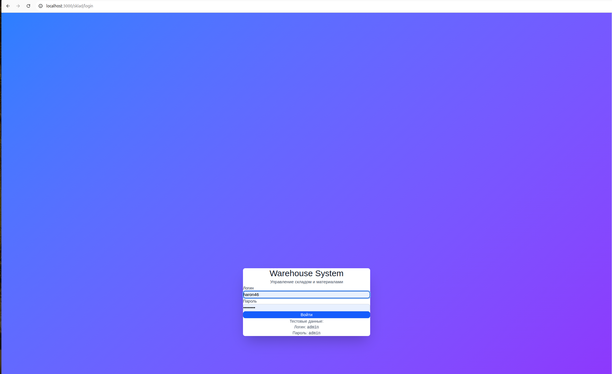

*Рисунок 16 — Страница входа в систему*

1. Откройте приложение в браузере по адресу, предоставленному администратором.
2. Введите логин и пароль.
3. Нажмите кнопку **«Войти»**.

### Первый вход сотрудника

- При создании учётной записи генерируется временный пароль.
- После первого входа система рекомендует сменить пароль в разделе **Профиль**.

### Восстановление доступа

- Обратитесь к администратору для сброса пароля.
- Администратор может изменить учётные данные в разделе **Сотрудники → Изменить учётные данные**.

---

## 3. Профиль пользователя

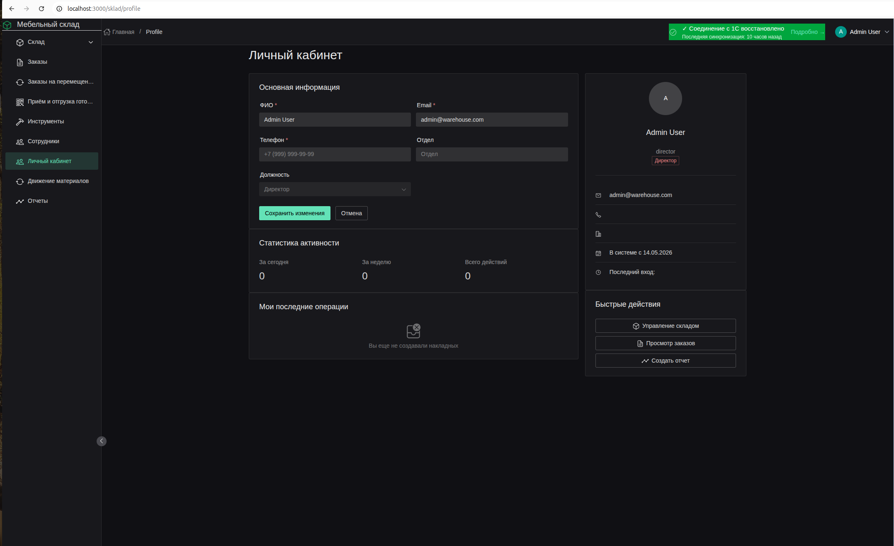

*Рисунок 17 — Страница профиля текущего пользователя*

Раздел для управления личными данными. Доступен из меню пользователя в правом верхнем углу.

| Функция           | Описание                   |
|-------------------|----------------------------|
| **Изменить пароль** | Смена текущего пароля     |
| **Обновить фото**   | Загрузка аватара          |
| **Контакты**        | Редактирование email и телефона |

---

## 4. Главная страница


*Рисунок 1 — Главная страница с дашбордом*

Главная страница представляет собой дашборд с быстрым доступом к основным разделам.

| Карточка                     | Описание                                   | Переход          |
|------------------------------|--------------------------------------------|------------------|
| 📊 **Управление складом**    | Просмотр и управление материалами и товарами | `/inventory`     |
| 📋 **Заказы**                | Создание и отслеживание заказов клиентов     | `/orders`        |
| 👥 **Сотрудники**            | Управление персоналом предприятия            | `/employees`     |

При загрузке страницы автоматически восстанавливаются данные из локального хранилища (localStorage) для работы в офлайн-режиме.

---

## 5. Склад ТМЦ

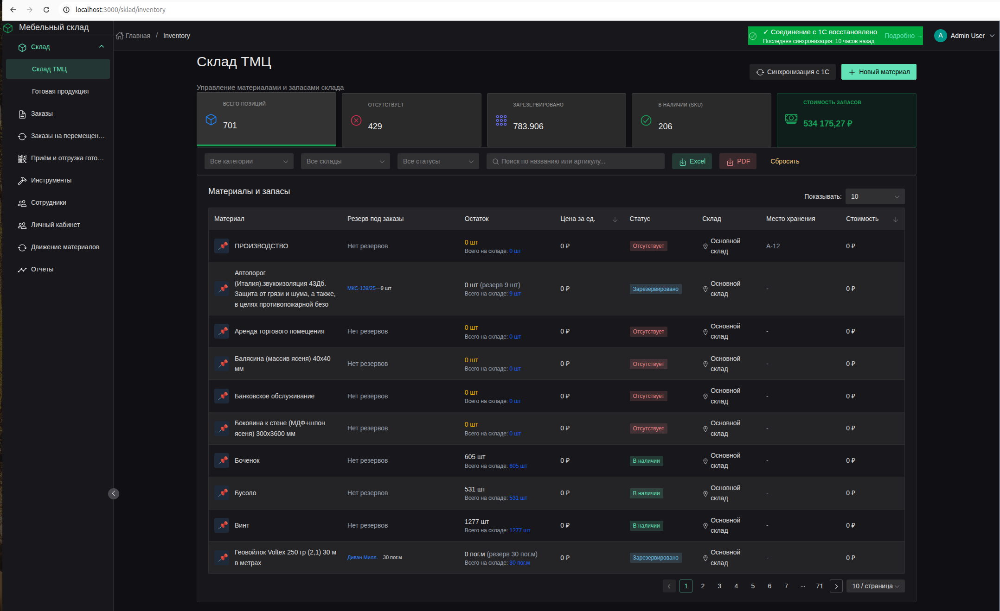

*Рисунок 2 — Страница управления материалами и запасами*

Страница **«Склад ТМЦ»** предназначена для управления материалами и запасами.

### 5.1. Статистические карточки

| Карточка              | Значение                                 | Действие при клике        |
|-----------------------|------------------------------------------|---------------------------|
| **Всего позиций**     | Общее количество SKU                     | Сброс фильтров            |
| **Отсутствует**       | Позиции со статусом «Отсутствует»        | Фильтр по статусу         |
| **Зарезервировано**   | Количество зарезервированных единиц      | Фильтр по резерву         |
| **В наличии (SKU)**   | Позиции со статусом «В наличии»          | Фильтр по наличию         |
| **Стоимость запасов** | Общая стоимость всех запасов             | —                         |

### 5.2. Фильтры и поиск

| Элемент     | Описание                                                     |
|-------------|--------------------------------------------------------------|
| **Категория**| Фильтр по категориям номенклатуры из 1С                      |
| **Склад**   | Фильтр по складам                                            |
| **Статус**  | Фильтр: В наличии / Мало / Отсутствует / Зарезервировано / В пути / Заблокировано |
| **Поиск**   | Поиск по названию, артикулу (SKU) или штрихкоду              |

### 5.3. Таблица материалов

| Колонка           | Описание                                                   |
|-------------------|------------------------------------------------------------|
| **Материал**      | Название + изображение                                     |
| **Резерв под заказы** | Список заказов, под которыми зарезервирован товар        |
| **Остаток**       | Доступное количество / Всего на складе / Резерв / В пути   |
| **Цена за ед.**   | Средняя цена (скрыто для рабочих)                          |
| **Статус**        | Цветной тег статуса                                        |
| **Склад**         | Название склада                                            |
| **Место хранения**| Ячейка/полка (storageBin)                                  |
| **Стоимость**     | Общая стоимость позиции (скрыто для рабочих)               |

### 5.4. Действия

| Действие              | Описание                                                   |
|-----------------------|------------------------------------------------------------|
| **Синхронизация с 1С**| Загрузка актуальных остатков и номенклатуры из 1С          |
| **Новый материал**    | Создание новой карточки материала                          |
| **Excel**             | Экспорт отфильтрованных данных в Excel                     |
| **PDF**               | Экспорт отфильтрованных данных в PDF                       |
| **Клик по строке**    | Открытие карточки материала для редактирования             |

### 5.5. Карточка материала

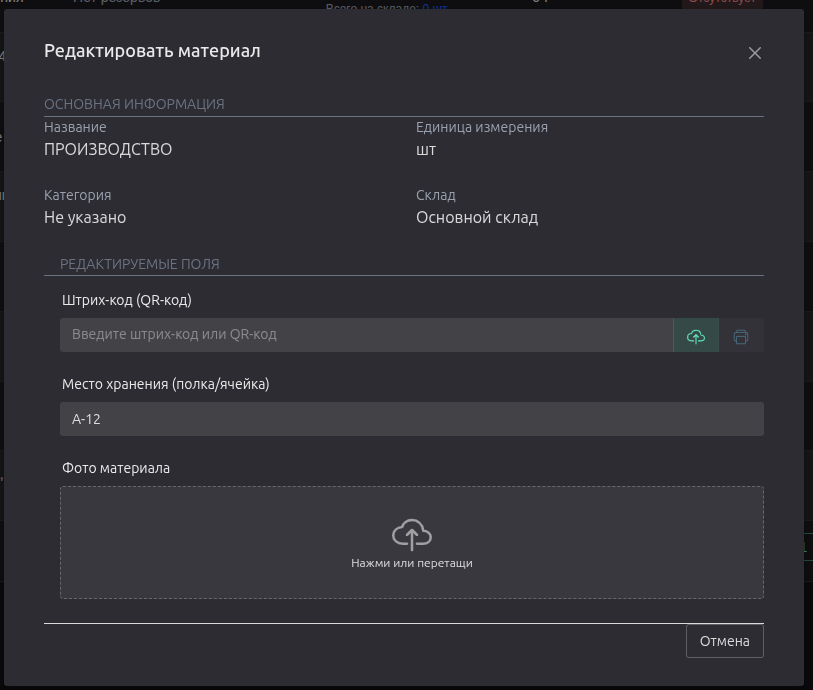

*Рисунок 11 — Модальное окно карточки материала*

| Поле             | Описание                                           |
|------------------|----------------------------------------------------|
| Название         | Наименование материала                             |
| Артикул (SKU)    | Уникальный код из 1С                               |
| Штрихкод         | Локальный штрихкод (генерируется автоматически)    |
| Категория        | Категория номенклатуры из 1С                       |
| Ед. измерения    | шт, м, м², кг и др.                                |
| Склад            | Склад хранения                                     |
| Место хранения   | Полка/ячейка (только локально)                     |
| Остаток          | Текущий остаток                                    |
| Мин./Макс. запас | Пороговые значения                                 |
| Резерв           | Зарезервированное количество                       |
| Статус           | Автоматически рассчитывается по остаткам           |
| Изображение      | Фото материала                                     |

---

## 6. Готовая продукция

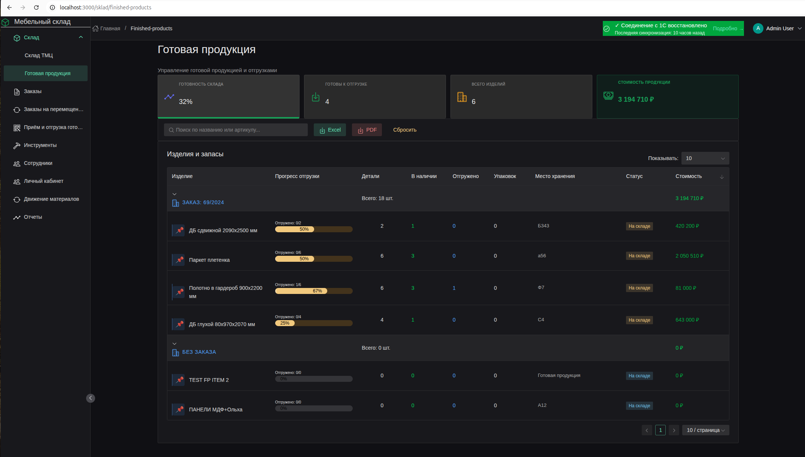

*Рисунок 3 — Страница готовой продукции*

Раздел аналогичен **Складу ТМЦ**, но отображает только изделия (продукцию собственного производства) с `categoryId = '99'`.

### Особенности

- Автоматическая генерация штрихкода в формате `PRD-YY-XXXXXX`.
- Автоматическое заполнение: SKU = штрихкод, место = `FG-ZONE`, категория = `99`.
- Поле **«Поставщик»** = «Собственное производство».
- Отображение прогресса отгрузки по заказам.

### Таблица готовой продукции

| Колонка           | Описание                                                   |
|-------------------|------------------------------------------------------------|
| **Изделие**       | Название + изображение                                     |
| **Резерв под заказы** | Список заказов, под которыми зарезервировано изделие    |
| **Остаток**       | Доступное количество / Всего на складе / Резерв            |
| **Статус**        | Цветной тег статуса                                        |
| **Место хранения**| Ячейка/полка (storageBin) — по умолчанию `FG-ZONE`         |
| **Действия**      | Печать штрихкода, редактирование                           |

---

## 7. Заказы покупателей

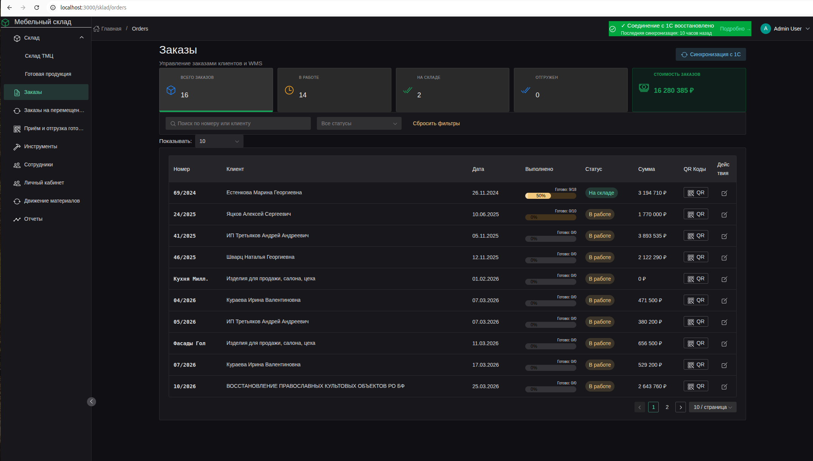

*Рисунок 4 — Страница управления заказами клиентов*

Страница **«Заказы покупателей»** предназначена для управления заказами клиентов и генерации QR-кодов.

### 7.1. Статистика

| Карточка           | Описание                                     |
|--------------------|----------------------------------------------|
| **Всего заказов**  | Общее количество заказов                     |
| **В работе**       | Заказы в производстве                        |
| **На складе**      | Заказы, готовые к отгрузке                   |
| **Отгружен**       | Уже отгруженные заказы                       |
| **Стоимость заказов** | Сумма заказов в работе (скрыто для рабочих) |

### 7.2. Таблица заказов

| Колонка     | Описание                                                |
|-------------|---------------------------------------------------------|
| **Номер**   | Номер заказа покупателя                                 |
| **Клиент**  | Наименование контрагента                                |
| **Дата**    | Дата заказа                                             |
| **Выполнено**| Прогресс QR-кодов: отсканировано/сгенерировано         |
| **Статус**  | В работе / На складе / Отгружен                         |
| **Сумма**   | Общая сумма заказа                                      |
| **QR Коды** | Кнопка управления QR-кодами заказа                      |
| **Действия**| Просмотр деталей заказа                                 |

### 7.3. QR-коды заказа

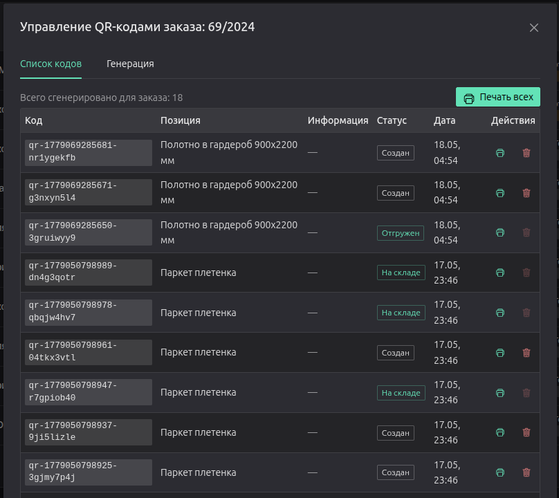

*Рисунок 12 — Модальное окно управления QR-кодами заказа*

При нажатии кнопки **QR** открывается модальное окно управления QR-кодами:

| Функция                 | Описание                                                    |
|-------------------------|-------------------------------------------------------------|
| **Сгенерировать все**   | Автоматическая генерация QR-кодов для всех позиций заказа   |
| **Печать всех**         | Печать всех QR-кодов заказа                                 |
| **Печать последних**    | Печать последних сгенерированных кодов                      |
| **Генерация с параметрами** | Выбор изделия, количества, доп. информации             |
| **Упаковочный код**     | Генерация QR-кода для упаковки (объединяет несколько изделий) |

### Статусы QR-кодов

| Статус       | Значение                                               |
|--------------|--------------------------------------------------------|
| **Создан**   | QR-код сгенерирован, но ещё не напечатан               |
| **Распечатан**| QR-код отправлен на печать                            |
| **На складе**| Изделие принято на склад (первое сканирование)         |
| **Отгружен** | Изделие отгружено клиенту (второе сканирование)        |

### 7.4. Детали заказа

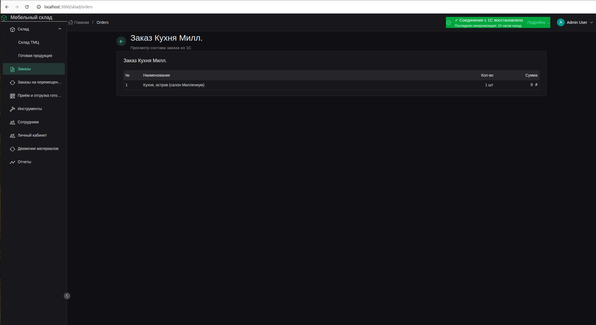

*Рисунок 18 — Детальная информация о заказе*

При клике на заказ открывается детальная информация:
- Состав заказа (позиции, количества, цены)
- Прогресс выполнения по QR-кодам
- История сканирований
- Кнопки действий: печать QR, отгрузка

---

## 8. Отгрузка (сканирование QR)

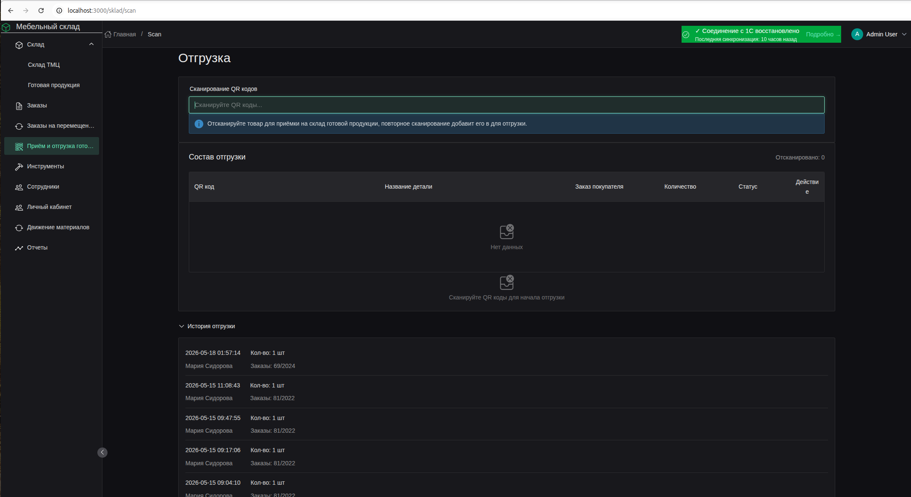

*Рисунок 5 — Рабочее место кладовщика для сканирования QR-кодов*

Страница **«Отгрузка»** — ключевой рабочий интерфейс для кладовщика.

### 8.1. Поле сканирования

- Введите или отсканируйте QR-код в поле ввода.
- Система автоматически распознаёт код через 300 мс после ввода.

### 8.2. Логика сканирования

| Действие                  | Результат                                                     | Статус QR               |
|---------------------------|---------------------------------------------------------------|-------------------------|
| **Первое сканирование**   | Товар добавляется в список перемещения на склад готовой продукции | `generated` → `scanned` |
| **Повторное сканирование**| Товар добавляется в текущую отгрузку                          | `scanned` → `shipped`   |
| **Сканирование отгруженного** | Сообщение: «Товар уже отгружен»                           | `shipped` (без изменений) |
| **Сканирование неизвестного** | Сообщение об ошибке                                       | —                       |

### 8.3. Кнопки действий

| Кнопка                  | Условие отображения                 | Действие                                           |
|-------------------------|-------------------------------------|----------------------------------------------------|
| **Переместить на склад**| Есть товары с первым сканированием  | Перемещение на склад готовой продукции, обновление статуса QR |
| **Отгрузить**           | Есть товары с повторным сканированием| Финальная отгрузка, обновление статуса QR на `shipped` |
| **Очистить**            | Есть отсканированные товары         | Очистка текущей сессии                             |

### 8.4. Таблица состава отгрузки


*Рисунок 21 — Таблица состава текущей отгрузки*

| Колонка          | Описание                                               |
|------------------|--------------------------------------------------------|
| **QR код**       | Код товара                                             |
| **Название детали** | Наименование изделия                                |
| **Заказ покупателя** | Номер заказа                                        |
| **Количество**   | Количество позиций                                     |
| **Статус**       | ↻ Ожидает перемещения / ✓ На складе / ✓✓ К отгрузке  |
| **Действие**     | Удаление позиции из сессии                             |

### 8.5. История отгрузки

Отображает последние 5 завершённых отгрузок с указанием:
- Даты и времени
- Сотрудника, выполнившего отгрузку
- Количества товаров
- Номеров заказов

---

## 9. Заказы на перемещение

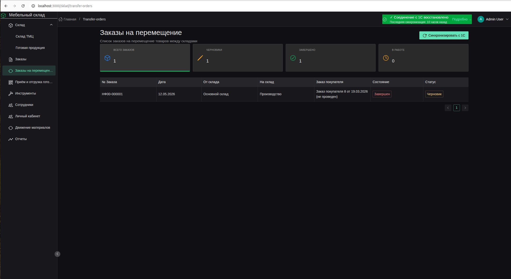

*Рисунок 6 — Страница заказов на перемещение между складами*

Раздел для работы с заказами на перемещение товаров между складами из 1С.

### 9.1. Список заказов

| Колонка               | Описание                        |
|-----------------------|---------------------------------|
| **№ Заказа**          | Номер документа перемещения     |
| **Дата**              | Дата создания                   |
| **От склада**         | Склад-отправитель               |
| **На склад**          | Склад-получатель                |
| **Заказ покупателя**  | Связанный заказ покупателя      |
| **Состояние**         | Завершён / В работе             |
| **Статус**            | Проведён / Черновик             |

### 9.2. Режим сканирования

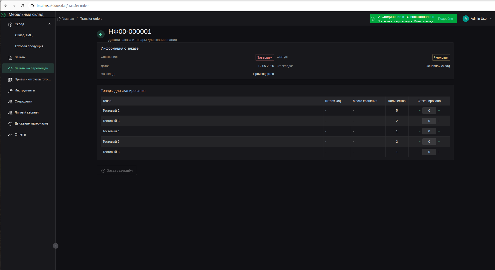

*Рисунок 20 — Режим сканирования товаров при перемещении*

1. Откройте заказ и нажмите **«Начать сканирование»** (или `Ctrl+S`).
2. Отсканируйте штрихкоды товаров.
3. Система автоматически сопоставляет штрихкод с позицией заказа.
4. Цветовая индикация:
   - 🟢 Зелёный — полностью отсканировано
   - 🟡 Жёлтый — отсканировано частично
   - 🔴 Красный — превышено количество

5. Нажмите **ESC** или **«Завершить сканирование»** для завершения.

### 9.3. Результаты сканирования

| Действие                | Описание                                                   |
|-------------------------|------------------------------------------------------------|
| **Сохранить локально**  | Сохранение результатов в локальную БД (если не всё отсканировано) |
| **Отправить в 1С**      | Отправка подтверждения в 1С (только если количества совпадают) |
| **Продолжить сканирование** | Возврат в режим сканирования                           |

---

## 10. Учёт инструментов

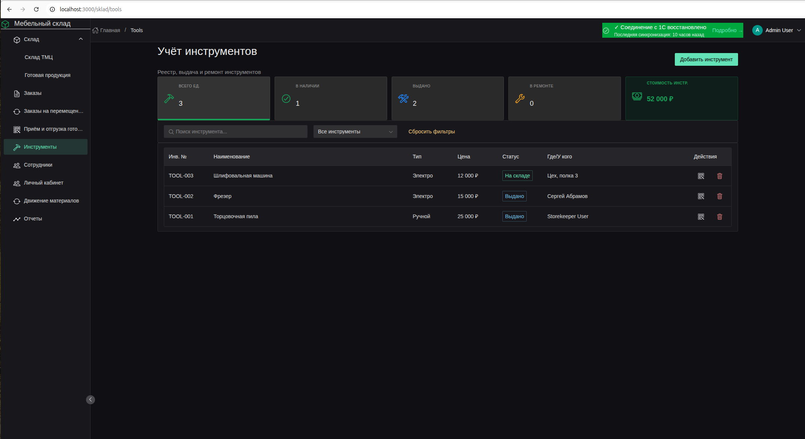

*Рисунок 7 — Страница учёта инструментального хозяйства*

Страница **«Учёт инструментов»** предназначена для контроля инструментального хозяйства.

### 10.1. Статистика

| Карточка           | Описание                                     |
|--------------------|----------------------------------------------|
| **Всего ед.**      | Общее количество инструментов                |
| **В наличии**      | Инструменты на складе                        |
| **Выдано**         | Инструменты у сотрудников                    |
| **В ремонте**      | Инструменты на ремонте                       |
| **Стоимость инстр.**| Общая стоимость (скрыто для рабочих)        |

### 10.2. Фильтры

| Фильтр      | Описание                                                   |
|-------------|------------------------------------------------------------|
| **Тип**     | Электро / Ручной / Измерительный / Оснастка / Тара         |
| **Статус**  | На складе / Выдано / В ремонте / Списано                   |
| **Поиск**   | По названию или инвентарному номеру                        |

### 10.3. Таблица инструментов

| Колонка        | Описание                                               |
|----------------|--------------------------------------------------------|
| **Инв. №**     | Инвентарный номер                                      |
| **Наименование** | Название инструмента                                 |
| **Тип**        | Электро / Ручной / Измерительный / Оснастка / Тара     |
| **Цена**       | Стоимость                                              |
| **Статус**     | На складе / Выдано / В ремонте / Списано               |
| **Где/У кого** | Место хранения или ФИО сотрудника                      |
| **Действия**   | Печать QR / Удаление                                   |

### 10.4. Карточка инструмента

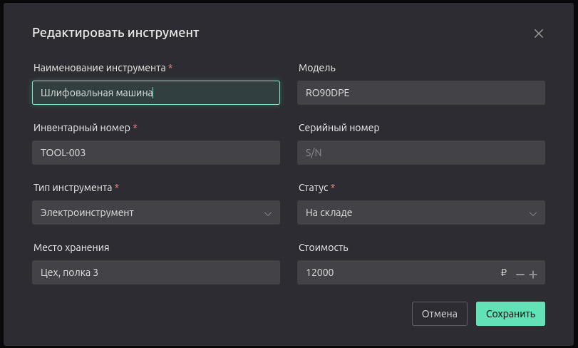

*Рисунок 19 — Модальное окно карточки инструмента*

| Поле             | Описание                                           |
|------------------|----------------------------------------------------|
| Наименование     | Название                                           |
| Инвентарный номер| Уникальный номер                                   |
| Тип              | Категория инструмента                              |
| Статус           | Текущий статус                                     |
| Выдано           | ФИО сотрудника (если выдано)                       |
| Место хранения   | Ячейка на складе                                   |
| Цена             | Стоимость                                          |
| QR-код           | Автоматически генерируется                         |

### 10.5. Действия с инструментом

| Действие      | Описание                                              |
|---------------|-------------------------------------------------------|
| **Выдать**    | Закрепление инструмента за сотрудником                |
| **Вернуть**   | Возврат инструмента на склад                          |
| **В ремонт**  | Отправка на ремонт                                    |
| **Списать**   | Списание с баланса                                    |
| **Печать QR** | Печать этикетки с QR-кодом для маркировки             |

---

## 11. Сотрудники

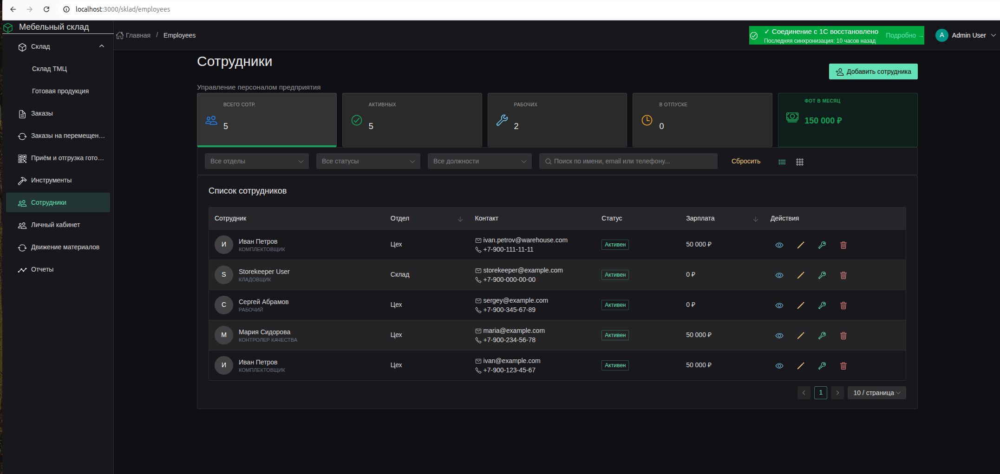

*Рисунок 8 — Страница управления персоналом*

Страница **«Сотрудники»** предназначена для управления персоналом предприятия.

### 11.1. Статистика

| Карточка         | Описание                                     |
|------------------|----------------------------------------------|
| **Всего сотр.**  | Общее количество сотрудников                 |
| **Активных**     | Сотрудники со статусом «Активен»             |
| **Рабочих**      | Сотрудники с ролью «Рабочий»                 |
| **В отпуске**    | Сотрудники в отпуске                         |
| **ФОТ в месяц**  | Фонд оплаты труда (скрыто для рабочих)       |

### 11.2. Фильтры

| Фильтр      | Описание                                                   |
|-------------|------------------------------------------------------------|
| **Отдел**   | Фильтр по подразделениям                                   |
| **Статус**  | Активен / Неактивен / Отпуск / Больничный                  |
| **Должность** | Администратор / Менеджер / Рабочий / Кладовщик / Производство |
| **Поиск**   | По имени, email, телефону                                  |

### 11.3. Режимы отображения

- **Список** — таблица с детальной информацией.
- **Плитки** — карточки с фото и основными данными.

### 11.4. Таблица сотрудников

| Колонка        | Описание                                               |
|----------------|--------------------------------------------------------|
| **ФИО**        | Полное имя сотрудника                                  |
| **Должность**  | Занимаемая должность                                   |
| **Отдел**      | Подразделение                                          |
| **Роль**       | Роль в системе (admin, manager, worker, и т.д.)        |
| **Статус**     | Активен / Неактивен / Отпуск / Больничный              |
| **Контакты**   | Email и телефон                                        |
| **Действия**   | Просмотр профиля / Редактировать / Удалить             |

### 11.5. Действия

| Действие                  | Доступ | Описание                               |
|---------------------------|--------|----------------------------------------|
| **Добавить сотрудника**   | Только admin | Создание новой учётной записи    |
| **Просмотр профиля**      | Все    | Полная анкета сотрудника               |
| **Редактировать**         | admin  | Изменение данных                       |
| **Изменить учётные данные** | admin | Смена логина/пароля                 |
| **Удалить**               | admin  | Удаление сотрудника                    |

### 11.6. Профиль сотрудника

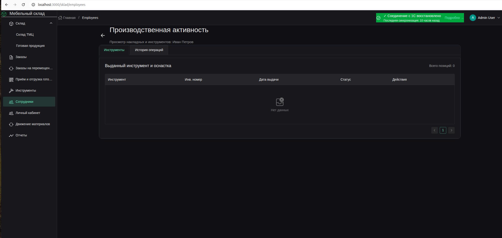

*Рисунок 15 — Карточка профиля сотрудника*

Содержит:
- Персональные данные (ФИО, дата рождения)
- Контакты (email, телефон)
- Должность и отдел
- История выдачи материалов (накладные)
- История инструментов
- Зарплата (доступно admin и manager)

---

## 12. Отчёты


*Рисунок 10 — Страница формирования отчётов*

Раздел формирования отчётов по складским операциям.

### Доступные отчёты

| Отчёт               | Описание                                       |
|---------------------|------------------------------------------------|
| **Остатки на складе** | Текущие остатки по всем позициям             |
| **Движение товаров**  | История прихода и расхода                    |
| **Резервы**           | Зарезервированные товары по заказам          |
| **История цен**       | Изменение цен по позициям                    |

### Фильтры отчётов

| Фильтр        | Описание                                            |
|---------------|-----------------------------------------------------|
| **Период**    | Дата начала и дата окончания                        |
| **Склад**     | Конкретный склад или все склады                     |
| **Категория** | Категория номенклатуры                              |
| **Статус**    | Статус документов (проведён / черновик)             |

### Экспорт отчётов

| Формат | Описание                                               |
|--------|--------------------------------------------------------|
| **Excel** | Выгрузка данных в формате `.xlsx` для дальнейшей обработки |
| **PDF**   | Печать отчёта в формате `.pdf`                       |

---

## Приложение А. Логика работы с QR-кодами

### А.1. Жизненный цикл QR-кода

```
generated (Создан)
    ↓  [Печать]
printed (Распечатан)
    ↓  [Первое сканирование на странице «Поступление на склад»]
scanned (На складе)
    ↓  [Второе сканирование на странице «Отгрузка»]
shipped (Отгружен)
```

### А.2. Первое сканирование — Поступление на склад

**Условия:**
- QR-код должен существовать в базе.
- Статус QR-кода должен быть `generated` (или `printed`).
- Товар ещё не был принят на склад.

**Результат:**
- Товар добавляется в список «Ожидает перемещения».
- Кладовщик нажимает кнопку **«Переместить на склад»**.
- Система отправляет запрос на бэкенд:
  - Создаётся запись о поступлении готовой продукции.
  - Статус QR-кода меняется на `scanned`.
  - Фиксируется время и сотрудник.
- Товар учитывается на складе готовой продукции.

### А.3. Второе сканирование — Отгрузка со склада

**Условия:**
- QR-код уже имеет статус `scanned` (находится на складе).
- Товар отсканирован повторно в текущей сессии.

**Результат:**
- Товар добавляется в список «К отгрузке».
- Кладовщик нажимает кнопку **«Отгрузить»**.
- Система отправляет запрос на бэкенд:
  - Статус QR-кода меняется на `shipped`.
  - Фиксируется время отгрузки и сотрудник.
- Товар исключается из остатков склада.

### А.4. Повторное сканирование в рамках одной сессии

| Ситуация                              | Результат                                         |
|---------------------------------------|---------------------------------------------------|
| Товар уже в списке «Ожидает перемещения» | Сообщение: «Товар уже добавлен в список перемещения» |
| Товар уже в списке «К отгрузке»       | Сообщение: «Товар уже добавлен к текущей отгрузке» |
| Товар уже отгружен (статус `shipped`) | Сообщение: «Товар уже отгружен»                   |

### А.5. Проверка комплектности заказа

При сканировании система автоматически проверяет количество отсканированных позиций по заказу:

| Условие                          | Сообщение                               |
|----------------------------------|-----------------------------------------|
| Все позиции заказа отсканированы | ✓ Заказ готов к отгрузке полностью      |
| Часть позиций отсканирована      | ⚠ Заказ отгружен не полностью           |

### А.6. Таблица статусов QR-кодов

| Статус        | Описание         | Доступные действия                        |
|---------------|------------------|-------------------------------------------|
| `generated`   | Сгенерирован     | Печать, первое сканирование               |
| `printed`     | Распечатан       | Первое сканирование                       |
| `scanned`     | На складе        | Второе сканирование (отгрузка)            |
| `shipped`     | Отгружен         | Нет действий (архив)                      |

---

## Приложение Б. Печать штрихкодов и QR-кодов

### Б.1. Печать штрихкода (материалы)

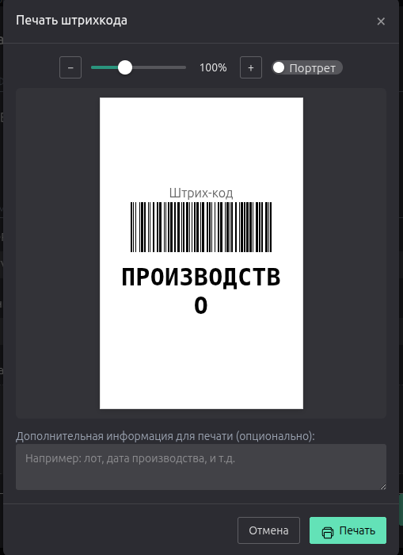

*Рисунок 13 — Модальное окно печати штрихкода*

**Доступно:** В карточке материала или изделия.

| Параметр              | Значение                                          |
|-----------------------|---------------------------------------------------|
| **Формат**            | CODE128                                           |
| **Размер этикетки**   | 68×104 мм (портрет) / 104×68 мм (альбом)          |
| **Высота штрихкода**  | 65 px (портрет) / 50 px (альбом)                  |
| **Ширина линий**      | 1.0 (портрет) / 2.5 (альбом)                      |
| **Шрифт названия**    | 30 px                                             |
| **Шрифт инфо**        | 20 px                                             |
| **Масштаб предпросмотра** | 50% — 200%                                    |

**Дополнительно:**
- Возможность добавить дополнительную информацию (лот, дата производства).
- Автоматическая обрезка текста до 40 символов.

### Б.2. Печать QR-кода (заказы, инструменты)

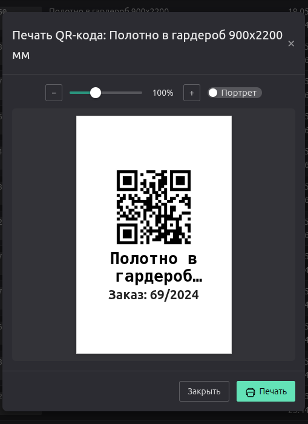

*Рисунок 14 — Модальное окно печати QR-кода*

**Доступно:** В модальном окне QR-кодов заказа или в карточке инструмента.

| Параметр              | Значение                                          |
|-----------------------|---------------------------------------------------|
| **Размер QR-кода**    | 35×35 мм                                          |
| **Размер этикетки**   | 68×104 мм (портрет) / 104×68 мм (альбом)          |
| **Шрифт заголовка**   | 20 pt                                             |
| **Шрифт описания**    | 16 pt                                             |
| **Масштаб предпросмотра** | 50% — 200%                                    |

### Б.3. Печать нескольких QR-кодов

- В заказе доступна пакетная печать всех QR-кодов.
- Каждый код печатается на отдельной странице с разрывом `page-break`.

---

## Приложение В. Горячие клавиши

| Клавиша    | Действие                 | Где работает              |
|------------|--------------------------|---------------------------|
| `Enter`    | Подтверждение сканирования | Страница «Отгрузка»      |
| `Escape`   | Завершение сканирования  | Заказы на перемещение     |
| `Ctrl+S`   | Начать сканирование      | Заказы на перемещение     |

---

## Приложение Г. Устранение неполадок

| Проблема            | Решение                                           |
|---------------------|---------------------------------------------------|
| QR-код не найден    | Проверьте, что код сгенерирован в системе         |
| Не открывается печать | Разрешите всплывающие окна в браузере           |
| Данные не обновляются | Выполните синхронизацию данных                  |
| Пустая страница     | Проверьте подключение к интернету или обратитесь к администратору |

---

*Документ актуален на версию системы от 2025 года.*

---

## 📎 Приложение Д. Руководство по созданию скриншотов

Для добавления скриншотов в документацию см. файл:
[`docs/screenshots/README.md`](docs/screenshots/README.md)

Там содержится:
- Полный список необходимых скриншотов (20 штук)
- Требования к качеству и формату
- Инструменты для создания скриншотов на Windows/macOS/Linux
- Чек-лист перед сохранением
- Структура папок для хранения изображений
