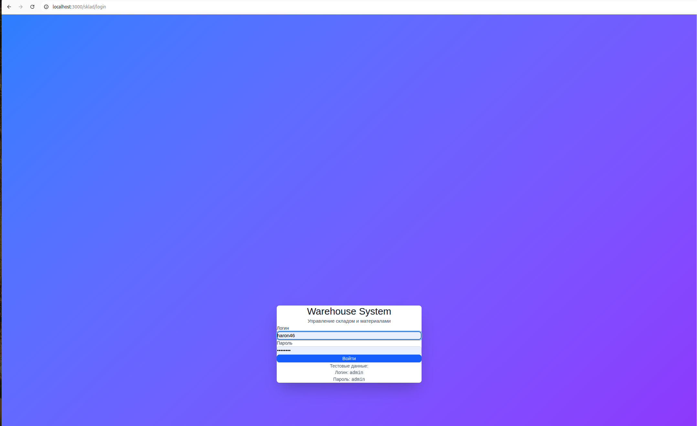
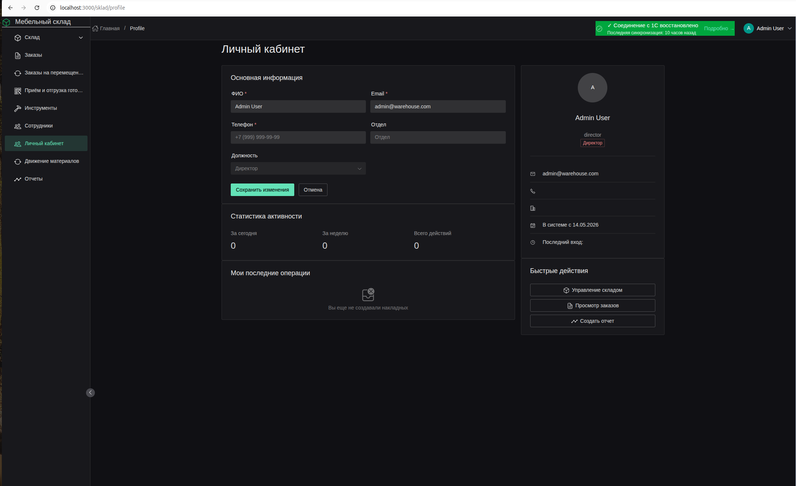
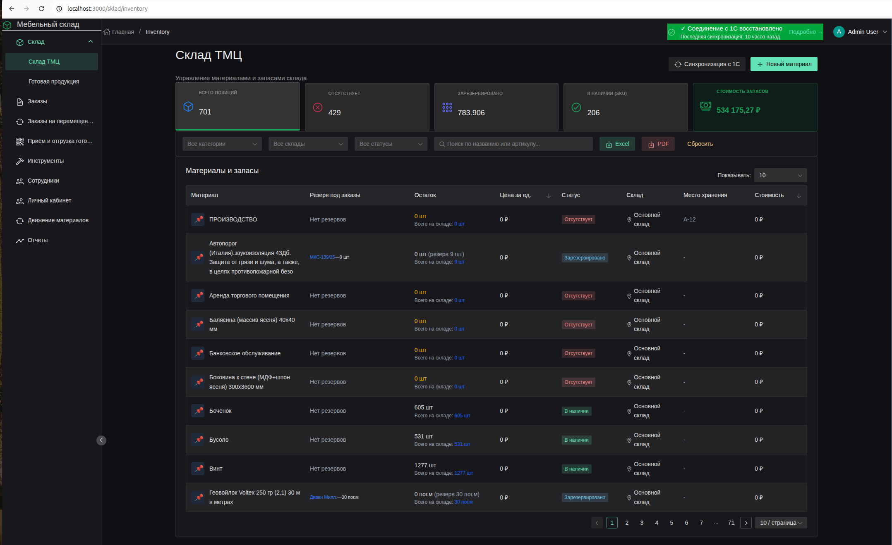
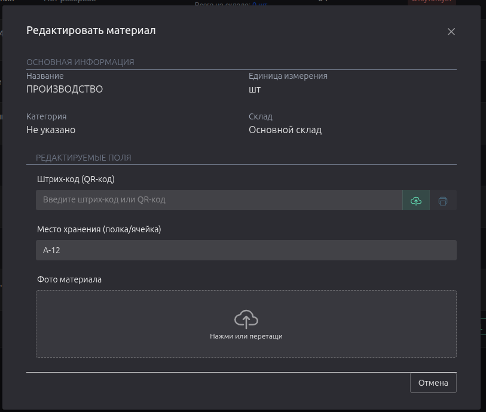
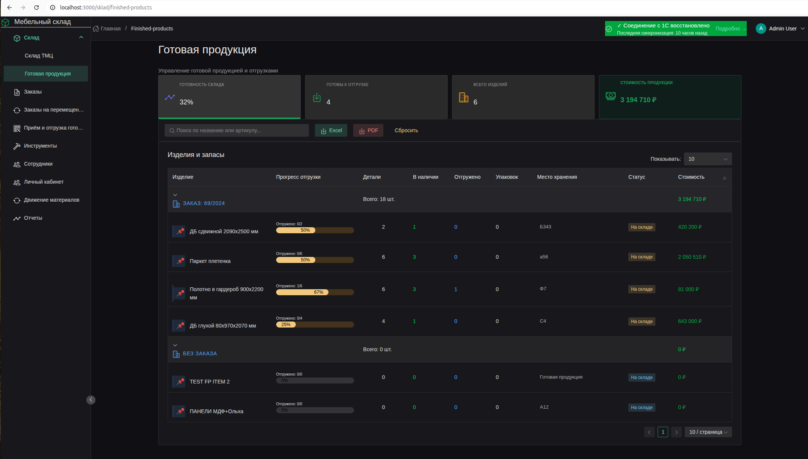
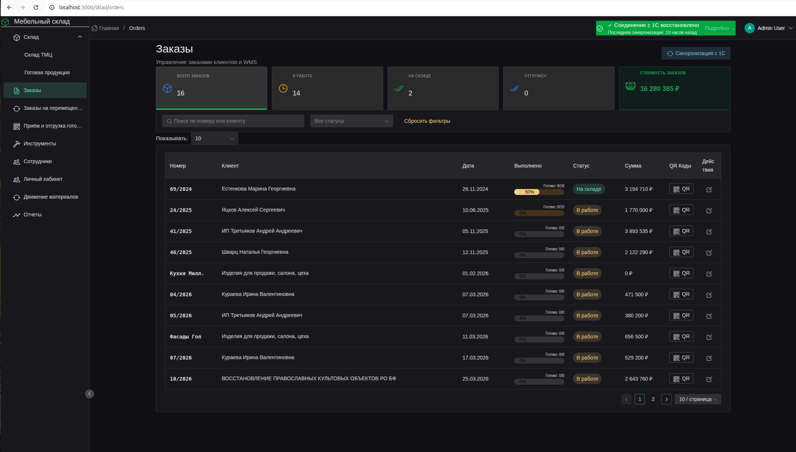
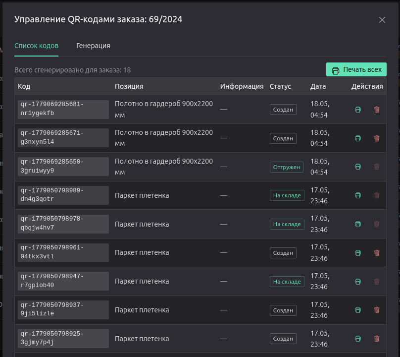
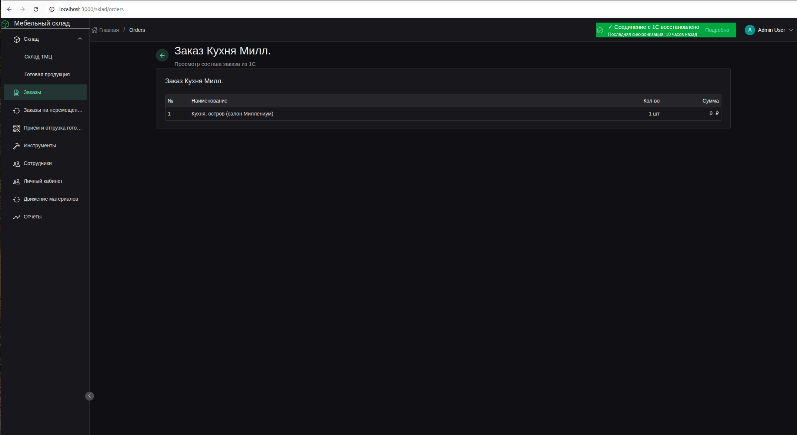
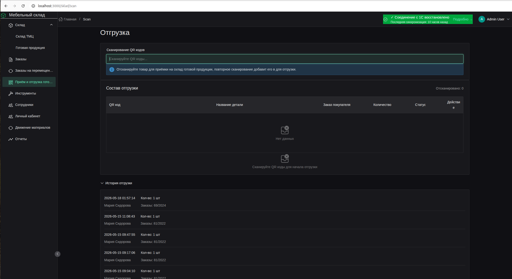

# Полное Руководство Пользователя

## Складская Система Управления (WMS)

> 📄 **PDF-версия:** Для удобства чтения и печати доступна [PDF-версия руководства](docs/USER_MANUAL.pdf).
> 
> 🖼️ **Скриншоты:** Все скриншоты находятся в папке `docs/screenshots/`.

---

## Содержание

### Общие разделы
1. [Введение](#1-введение)
2. [Авторизация и доступ](#2-авторизация-и-доступ)
3. [Профиль пользователя](#3-профиль-пользователя)

### Страницы системы
4. [Главная страница](#4-главная-страница)
5. [Склад ТМЦ](#5-склад-тмц)
6. [Готовая продукция](#6-готовая-продукция)
7. [Заказы покупателей](#7-заказы-покупателей)
8. [Приём и отгрузка](#8-приём-и-отгрузка)
9. [Движение материалов](#9-движение-материалов)
10. [Заказы на перемещение](#10-заказы-на-перемещение)
11. [Фурнитура](#11-фурнитура)
12. [Учёт инструментов](#12-учёт-инструментов)
13. [Сотрудники](#13-сотрудники)
14. [Отчёты](#14-отчёты)
15. [Интеграция с 1С](#15-интеграция-с-1с)
16. [Материалы в работе](#16-материалы-в-работе)

### Приложения
- [Приложение А. Штрихкоды и QR-коды](#приложение-а-штрихкоды-и-qr-коды)
- [Приложение Б. Печать штрихкодов и QR-кодов](#приложение-б-печать-штрихкодов-и-qr-кодов)
- [Приложение В. Горячие клавиши](#приложение-в-горячие-клавиши)
- [Приложение Г. Устранение неполадок](#приложение-г-устранение-неполадок)
- [Приложение Д. Пошаговые инструкции](#приложение-д-пошаговые-инструкции)

---

## 1. Введение

Система предназначена для управления складскими операциями: учёт материалов, готовой продукции, заказов, инструментов и персонала. Интегрирована с 1С для синхронизации номенклатуры, заказов и остатков.

### Роли пользователей

| Роль         | Описание      | Доступные функции                               |
|--------------|---------------|-------------------------------------------------|
| **admin**    | Администратор | Полный доступ: сотрудники, цены, настройки      |
| **manager**  | Менеджер      | Заказы, материалы, отчёты, цены                 |
| **worker**   | Рабочий       | Просмотр, сканирование, базовые операции        |
| **warehouse**| Кладовщик     | Склад, отгрузка, перемещения, сканирование      |
| **production**| Производство | Готовая продукция, сканирование, перемещение    |

---

## 2. Авторизация и доступ

### Вход в систему



*Рисунок 1 — Страница входа в систему*

1. Откройте приложение в браузере по адресу, предоставленному администратором.
2. Введите логин и пароль.
3. Нажмите кнопку **«Войти»**.

### Первый вход сотрудника

- При создании учётной записи генерируется временный пароль.
- После первого входа система рекомендует сменить пароль в разделе **Профиль**.

### Восстановление доступа

- Обратитесь к администратору для сброса пароля.
- Администратор может изменить учётные данные в разделе **Сотрудники → Изменить учётные данные**.

---

## 3. Профиль пользователя



*Рисунок 2 — Страница профиля текущего пользователя*

Раздел для управления личными данными. Доступен из меню пользователя в правом верхнем углу.

| Функция           | Описание                   |
|-------------------|----------------------------|
| **Изменить пароль** | Смена текущего пароля     |
| **Обновить фото**   | Загрузка аватара          |
| **Контакты**        | Редактирование email и телефона |

---

## 4. Главная страница


*Рисунок 3 — Главная страница с дашбордом*

Главная страница представляет собой дашборд с быстрым доступом к основным разделам.

| Карточка                     | Описание                                   | Переход          |
|------------------------------|--------------------------------------------|------------------|
| 📊 **Управление складом**    | Просмотр и управление материалами и товарами | `/inventory`     |
| 📋 **Заказы**                | Создание и отслеживание заказов клиентов     | `/orders`        |
| 👥 **Сотрудники**            | Управление персоналом предприятия            | `/employees`     |

При загрузке страницы автоматически восстанавливаются данные из локального хранилища (localStorage) для работы в офлайн-режиме.

---

## 5. Склад ТМЦ



*Рисунок 4 — Страница управления материалами и запасами*

Страница **«Склад ТМЦ»** предназначена для управления материалами и запасами.

### 5.1. Статистические карточки

| Карточка              | Значение                                 | Действие при клике        |
|-----------------------|------------------------------------------|---------------------------|
| **Всего позиций**     | Общее количество SKU                     | Сброс фильтров            |
| **Отсутствует**       | Позиции со статусом «Отсутствует»        | Фильтр по статусу         |
| **Зарезервировано**   | Количество зарезервированных единиц      | Фильтр по резерву         |
| **В наличии (SKU)**   | Позиции со статусом «В наличии»          | Фильтр по наличию         |
| **Стоимость запасов** | Общая стоимость всех запасов             | —                         |

### 5.2. Фильтры и поиск

| Элемент     | Описание                                                     |
|-------------|--------------------------------------------------------------|
| **Категория**| Фильтр по категориям номенклатуры из 1С                      |
| **Склад**   | Фильтр по складам                                            |
| **Статус**  | Фильтр: В наличии / Мало / Отсутствует / Зарезервировано / В пути / Заблокировано |
| **Поиск**   | Поиск по названию, артикулу (SKU) или штрихкоду              |

### 5.3. Таблица материалов

| Колонка           | Описание                                                   |
|-------------------|------------------------------------------------------------|
| **Материал**      | Название + изображение                                     |
| **Резерв под заказы** | Список заказов, под которыми зарезервирован товар        |
| **Остаток**       | Доступное количество / Всего на складе / Резерв / В пути   |
| **Цена за ед.**   | Средняя цена (скрыто для рабочих)                          |
| **Статус**        | Цветной тег статуса                                        |
| **Склад**         | Название склада                                            |
| **Место хранения**| Ячейка/полка (storageBin)                                  |
| **Стоимость**     | Общая стоимость позиции (скрыто для рабочих)               |

### 5.4. Действия

| Действие              | Описание                                                   |
|-----------------------|------------------------------------------------------------|
| **Синхронизация с 1С**| Загрузка актуальных остатков и номенклатуры из 1С          |
| **Новый материал**    | Создание новой карточки материала                          |
| **Excel**             | Экспорт отфильтрованных данных в Excel                     |
| **PDF**               | Экспорт отфильтрованных данных в PDF                       |
| **Клик по строке**    | Открытие карточки материала для редактирования             |

### 5.5. Карточка материала



*Рисунок 5 — Модальное окно карточки материала*

| Поле             | Описание                                           |
|------------------|----------------------------------------------------|
| Название         | Наименование материала                             |
| Артикул (SKU)    | Уникальный код из 1С                               |
| Штрихкод         | Локальный штрихкод (генерируется кнопкой в карточке). Используется **только для ТМЦ** — никогда не заполняется из QR-кодов или 1С |
| Категория        | Категория номенклатуры из 1С                       |
| Ед. измерения    | шт, м, м², кг и др.                                |
| Склад            | Склад хранения                                     |
| Место хранения   | Полка/ячейка (только локально). В режиме нескольких складов отображаются два поля: **«Склад ТМЦ»** и **«Склад ГП»** |
| Остаток          | Текущий остаток                                    |
| Мин./Макс. запас | Пороговые значения                                 |
| Резерв           | Зарезервированное количество                       |
| Статус           | Автоматически рассчитывается по остаткам           |
| Изображение      | Фото материала                                     |

**Штрихкод (barcode):** Генерируется нажатием кнопки в карточке материала. Привязан к записи ТМЦ-склада. В режиме нескольких складов штрихкод читается и сохраняется из/в запись ТМЦ, а не ГП.

---

## 6. Готовая продукция



*Рисунок 6 — Страница готовой продукции*

Раздел аналогичен **Складу ТМЦ**, но отображает только изделия (продукцию собственного производства) с `categoryId = '99'`.

### Особенности

- Автоматическая генерация штрихкода в формате `PRD-YY-XXXXXX`.
- Автоматическое заполнение: SKU = штрихкод, место = `FG-ZONE`, категория = `99`.
- Поле **«Поставщик»** = «Собственное производство».
- Отображение прогресса отгрузки по заказам.

### Таблица готовой продукции

| Колонка           | Описание                                                   |
|-------------------|------------------------------------------------------------|
| **Изделие**       | Название + изображение                                     |
| **Резерв под заказы** | Список заказов, под которыми зарезервировано изделие    |
| **Остаток**       | Доступное количество / Всего на складе / Резерв            |
| **Статус**        | Цветной тег статуса                                        |
| **Место хранения**| Ячейка/полка (storageBin) — по умолчанию `FG-ZONE`         |
| **Действия**      | Печать штрихкода, редактирование                           |

**QR-коды:** Для готовой продукции используются QR-коды (не штрихкоды). QR-коды генерируются в разделе **«Заказы покупателей» → QR Коды** и привязываются к позициям заказа.

---

## 7. Заказы покупателей



*Рисунок 7 — Страница управления заказами клиентов*

Страница **«Заказы покупателей»** предназначена для управления заказами клиентов и генерации QR-кодов.

### 7.1. Статистика

| Карточка           | Описание                                     |
|--------------------|----------------------------------------------|
| **Всего заказов**  | Общее количество заказов                     |
| **В работе**       | Заказы в производстве                        |
| **На складе**      | Заказы, готовые к отгрузке                   |
| **Отгружен**       | Уже отгруженные заказы                       |
| **Стоимость заказов** | Сумма заказов в работе (скрыто для рабочих) |

### 7.2. Таблица заказов

| Колонка     | Описание                                                |
|-------------|---------------------------------------------------------|
| **Номер**   | Номер заказа покупателя                                 |
| **Клиент**  | Наименование контрагента                                |
| **Дата**    | Дата заказа                                             |
| **Выполнено**| Прогресс QR-кодов: отсканировано/сгенерировано         |
| **Статус**  | В работе / На складе / Отгружен                         |
| **Сумма**   | Общая сумма заказа                                      |
| **QR Коды** | Кнопка управления QR-кодами заказа                      |
| **Действия**| Просмотр деталей заказа                                 |

### 7.3. QR-коды заказа



*Рисунок 8 — Модальное окно управления QR-кодами заказа*

При нажатии кнопки **QR** открывается модальное окно управления QR-кодами:

| Функция                 | Описание                                                    |
|-------------------------|-------------------------------------------------------------|
| **Сгенерировать все**   | Автоматическая генерация QR-кодов для всех позиций заказа   |
| **Печать всех**         | Печать всех QR-кодов заказа                                 |
| **Печать последних**    | Печать последних сгенерированных кодов                      |
| **Генерация с параметрами** | Выбор изделия, количества, доп. информации             |
| **Упаковочный код**     | Генерация QR-кода для упаковки (объединяет несколько изделий) |

### Статусы QR-кодов

| Статус       | Значение                                               |
|--------------|--------------------------------------------------------|
| **Создан**   | QR-код сгенерирован, но ещё не напечатан               |
| **Распечатан**| QR-код отправлен на печать                            |
| **На складе**| Изделие принято на склад (первое сканирование)         |
| **Отгружен** | Изделие отгружено клиенту (второе сканирование)        |

### 7.4. Детали заказа



*Рисунок 9 — Детальная информация о заказе*

При клике на заказ открывается детальная информация:
- Состав заказа (позиции, количества, цены)
- Прогресс выполнения по QR-кодам
- История сканирований
- Кнопки действий: печать QR, отгрузка

---

## 8. Приём и отгрузка



*Рисунок 10 — Рабочее место кладовщика для сканирования QR-кодов*

Страница **«Приём и отгрузка»** — ключевой рабочий интерфейс для кладовщика.

### 8.1. Поле сканирования

- Введите или отсканируйте QR-код в поле ввода и нажмите **Enter**.
- Большинство сканеров автоматически отправляют Enter после кода — сканирование срабатывает мгновенно.
- Если сканер не шлёт Enter, нажмите Enter вручную.
- `isScanning` guard блокирует повторный вызов, пока предыдущее сканирование не завершится (предотвращает дубли).
- Поддерживается транслитерация русской раскладки (сканер вводит символы в текущей раскладке).

### 8.2. Логика сканирования

| Действие                  | Результат                                                     | Статус QR               |
|---------------------------|---------------------------------------------------------------|-------------------------|
| **Первое сканирование**   | Товар добавляется в список перемещения на склад готовой продукции | `generated` → `scanned` |
| **Повторное сканирование**| Товар добавляется в текущую отгрузку                          | `scanned` → `shipped`   |
| **Сканирование отгруженного** | Сообщение: «Товар уже отгружен»                           | `shipped` (без изменений) |
| **Сканирование неизвестного** | Сообщение об ошибке                                       | —                       |

### 8.3. Упаковочные коды и контроль комплектности

- Если позиция заказа имеет **упаковочные QR-коды**, отгрузка производится **только по упаковкам**.
- При сканировании детали позиции, у которой есть упаковки, выводится сообщение:
  ```
  ❌ Деталь нужно упаковать и переместить упаковку на склад, после чего её можно отгрузить.
  ```
  Деталь не добавляется в документ отгрузки.
- При приёмке на склад: сначала сканируются все детали, затем упаковка — порядок обязателен.

### 8.4. Реактивная валидация отгрузки

Система в реальном времени анализирует состав отгрузки и выводит информационное сообщение под полем сканирования:

| Тип сообщения | Пример |
|---------------|--------|
| **Успех** | `✓ заказ 24/2025: отгружается 1 упаковка, заказ будет отгружен полностью: Полка: 1/2 будет отгружена полностью` |
| **Предупреждение** | `⚠ заказ 24/2025: отгружается 1 деталь из 4, заказ будет отгружен не полностью: Стол: 1 деталь из 5` |
| **Инфо (приёмка)** | `К приёмке: заказ 24/2025: 3 из 10 шт.` |

**Логика подсчёта:**
- Для позиций с упаковочными кодами общее количество = только упаковки (детали не учитываются)
- Для позиций без упаковок = все QR-коды позиции
- Число «из N» показывает оставшиеся неотгруженные позиции, а не общее количество в заказе
- Если все оставшиеся позиции отсканированы — сообщение зелёное (успех), иначе — жёлтое (предупреждение)

**Правильные окончания:** система использует корректные формы слов:
- 1 деталь, 3 детали, 5 деталей
- 1 упаковка, 2 упаковки, 5 упаковок

### 8.5. Кнопки действий

| Кнопка                  | Условие отображения                 | Действие                                           |
|-------------------------|-------------------------------------|----------------------------------------------------|
| **Переместить на склад**| Есть товары с первым сканированием  | Перемещение на склад готовой продукции, обновление статуса QR |
| **Отгрузить**           | Есть товары с повторным сканированием| Финальная отгрузка, обновление статуса QR на `shipped` |
| **Очистить**            | Есть отсканированные товары         | Очистка текущей сессии                             |

### 8.6. Таблица состава отгрузки


*Рисунок 11 — Таблица состава текущей отгрузки*

| Колонка          | Описание                                               |
|------------------|--------------------------------------------------------|
| **QR код**       | Код товара                                             |
| **Название детали** | Наименование изделия                                |
| **Заказ покупателя** | Номер заказа                                        |
| **Количество**   | Количество позиций                                     |
| **Статус**       | ↻ Ожидает перемещения / ✓ На складе / ✓✓ К отгрузке  |
| **Действие**     | Удаление позиции из сессии                             |

### 8.7. История отгрузки

Отображает последние 5 завершённых отгрузок с указанием:
- Даты и времени
- Сотрудника, выполнившего отгрузку
- Количества товаров
- Номеров заказов

---

## 9. Движение материалов


*Рисунок 12 — Страница истории движения материалов*

Страница **«Движение материалов»** отображает все операции с материалами и готовой продукцией: поступление на склад, отгрузку клиентам, перемещение между складами и операции с инструментами.

### 9.1. Статистические карточки

Над таблицей расположены карточки быстрой фильтрации по направлению:

| Карточка              | Описание                                     | Действие при клике        |
|-----------------------|----------------------------------------------|---------------------------|
| **Всего операций**    | Общее количество записей                     | Сброс фильтров            |
| **Отгружено клиентам**| Операции отгрузки готовой продукции           | Фильтр по «Клиент»        |
| **Готовая продукция** | Поступление на склад ГП                      | Фильтр по «Готовая продукция» |
| **Перемещение**       | Перемещение между складами                   | Фильтр по «Перемещение»   |
| **Инструменты**       | Операции с инструментами и фурнитурой         | Фильтр по «Инструмент»    |

### 9.2. Фильтры

| Элемент     | Описание                                                     |
|-------------|--------------------------------------------------------------|
| **Направление** | Выпадающий список: Все / Готовая продукция / Клиент / Перемещение / Инструмент / Фурнитура |
| **Поиск**   | Поиск по номеру заказа, названию товара или ФИО сотрудника   |
| **Сбросить**| Очистка всех фильтров                                        |

### 9.3. Типы операций

Страница объединяет данные из четырёх источников:
1. **Накладные материалов** (`material_invoices`) — поступление ТМЦ и готовой продукции
2. **История отгрузок** (`operation_logs`) — отгрузки QR-кодов
3. **Заказы на перемещение** (`transfer_orders`) — перемещение между складами
4. **Операции с инструментами** (`tool_operations`) — выдача/возврат инструментов, выдача/возврат фурнитуры

### 9.4. Таблица операций

Включает выбор количества строк на странице: **10, 25, 50, 100**.

| Колонка          | Описание                                                   |
|------------------|------------------------------------------------------------|
| **Дата и время** | Дата и время операции                                      |
| **Назначение**   | Готовая продукция / Клиент / Перемещение / Инструмент / Фурнитура |
| **Операция**     | Тип операции (Поступил на склад, Отгружен клиенту, Выдан инструмент и т.д.) |
| **Заказ**        | Номер заказа покупателя                                    |
| **Ответственный**| ФИО сотрудника, выполнившего операцию                      |
| **Позиций**      | Количество позиций в операции                              |

### 9.5. Раскрытие деталей

При клике на строку таблицы раскрывается подробная информация о составе операции:
- Для накладных: таблица с наименованиями, ценами и количествами
- Для отгрузок: количество отгруженных QR-кодов и номера заказов
- Для перемещений: состав товаров из заказа на перемещение

### 9.6. Детали накладной

При выборе строки также доступен полный просмотр накладной:
- Номер заказа, дата, сотрудник
- Таблица позиций с ценами и количеством
- Итоговая сумма к списанию

---

## 10. Заказы на перемещение

Раздел для работы с заказами на перемещение товаров между складами из 1С.

### 10.1. Статистические фильтры

| Карточка       | Описание                                 | Действие при клике        |
|----------------|------------------------------------------|---------------------------|
| **Всего заказов** | Общее количество                     | Сброс фильтров            |
| **Черновики**  | Локальные заказы (не отправленные в 1С) | Фильтр по локальным заказам |
| **В работе (ячейки)** | Заказы со статусом «В работе (ячейки)» | Фильтр по статусу         |
| **В работе (списание)** | Заказы со статусом «В работе (к списанию)» | Фильтр по статусу         |
| **Завершено (ячейки)** | Заказы со статусом «Завершён (ячейки)» | Фильтр по завершённым     |
| **Завершено (списание)** | Заказы со статусом «Завершён (списание)» | Фильтр по завершённым     |

### 10.2. Таблица заказов

Включает выбор количества строк на странице: **10, 25, 50, 100**.

| Колонка               | Описание                        |
|-----------------------|---------------------------------|
| **№ Заказа**          | Номер документа перемещения     |
| **Дата**              | Дата создания                   |
| **От склада**         | Склад-отправитель               |
| **На склад**          | Склад-получатель                |
| **Заказ покупателя**  | Связанный заказ покупателя      |
| **Состояние**         | Статус заказа                   |

### 10.3. Создание нового заказа

1. Нажмите **«Новый заказ на перемещение»** (зелёная кнопка).
2. Выберите **склад-отправитель** и **склад-получатель**.
3. **Сканирование или поиск товара** — поле ввода поддерживает два режима:
   - **Сканирование штрихкода** — код распознаётся автоматически, товар добавляется без нажатия кнопок
   - **Поиск по названию** — начните вводить название (от 2 символов), появится выпадающий список. Поиск **регистронезависимый**.
   - Если штрихкод не найден — товар **не добавляется**, выводится предупреждение
4. При необходимости измените **количество** или удалите позиции.
5. Выберите: **«Сохранить локально»** (черновик LOCAL-) или **«Сохранить и отправить в 1С»** (статус «В работе (к списанию)»).

### 10.4. Локальные заказы (черновики)

- Номер начинается с `LOCAL-`, статус **«Черновик»**
- **Не удаляются** при синхронизации с 1С
- Можно редактировать, добавлять товары, затем **«Отправить в 1С»**
- При повторном сканировании того же штрихкода количество увеличивается на 1
- Поле **«Количество»** поддерживает целые и дробные числа (`2,5` или `2.5`)

### 10.5. Режим сканирования

Доступен для заказов из 1С со статусом **«В работе (ячейки)»**. Нажмите **«Начать сканирование»** (или `Ctrl+S`).

- 🟢 Зелёный — полностью отсканировано
- 🟡 Жёлтый — отсканировано частично
- 🔴 Красный — превышено количество
- Поле **«Отсканировано»** поддерживает дробные числа (`2,5` или `2.5`)
- `ESC` или **«Завершить сканирование»** для выхода

### 10.6. Результаты сканирования

| Действие                | Описание                                                   |
|-------------------------|------------------------------------------------------------|
| **Сохранить локально**  | Сохранение результатов (если не всё отсканировано)          |
| **Отправить в 1С**      | Отправка подтверждения (только если количества совпадают)   |
| **Продолжить**          | Возврат в режим сканирования                               |

---

## 11. Фурнитура

Страница **«Фурнитура»** — управление складом фурнитуры: выдача сотрудникам и возврат.

### 11.1. Статистические карточки

| Карточка              | Описание                                     | Действие при клике        |
|-----------------------|----------------------------------------------|---------------------------|
| **Всего позиций**     | Общее количество позиций фурнитуры           | Сброс фильтров            |
| **В наличии**         | Позиции с доступным остатком                 | Фильтр по наличию         |
| **Выдано**            | Позиции, выданные сотрудникам                | Фильтр по выдаче          |
| **Нет в наличии**     | Позиции с нулевым остатком                   | Фильтр по отсутствию      |
| **Инвентаризация**    | Позиции с расхождением остатков (1С < выдано) | Фильтр по расхождению     |
| **Общая стоимость**   | Суммарная стоимость (скрыто для рабочих)     | —                         |

### 11.2. Фильтры и таблица

| Элемент     | Описание                                                     |
|-------------|--------------------------------------------------------------|
| **Поиск**   | По названию, инвентарному номеру или артикулу                |
| **Статус**  | Все / В наличии / Выдано / Нет в наличии / Инвентаризация    |

Включает выбор количества строк: **10, 25, 50, 100**.

| Колонка          | Описание                                                   |
|------------------|------------------------------------------------------------|
| **Наименование** | Название фурнитуры                                         |
| **Ед. изм.**     | Единица измерения                                          |
| **На складе**    | Текущий остаток (цветовая индикация)                       |
| **Выдано**       | Количество, выданное сотрудникам                           |
| **Цена**         | Стоимость (скрыто для рабочих)                              |
| **Статус**       | На складе / Всё выдано / Частично выдано / Нет в наличии / Инвентаризация |
| **Место хранения**| Ячейка/полка                                              |
| **Склад**        | Название склада                                            |
| **Действия**     | Выдать / Инвентаризация                                    |

### 11.3. Выдача фурнитуры

Модальное окно: выбор сотрудника, количества, привязка к заказу. Если статус «Инвентаризация» — выдача заблокирована, нужно сначала вернуть фурнитуру.

### 11.4. Карточка фурнитуры

При клике на строку — детальная страница с метриками: **На складе ТМЦ**, **На складе ГП**, **Выдано**, **Доступно**, **Сотрудников**, **В 1С**.

**Таблица выдач:** список сотрудников с количеством, датой и заказом. Кнопка **«Сдать»** — возврат на склад.

**Предупреждение:** Если 1С < выдано — красное предупреждение, нужно вернуть для восстановления баланса.

---

## 12. Учёт инструментов

Страница **«Учёт инструментов»** — контроль инструментального хозяйства.

### 12.1. Статистика

| Карточка           | Описание                                     |
|--------------------|----------------------------------------------|
| **Всего ед.**      | Общее количество инструментов                |
| **В наличии**      | Инструменты на складе                        |
| **Выдано**         | Инструменты у сотрудников                    |
| **В ремонте**      | Инструменты на ремонте                       |
| **Стоимость инстр.**| Общая стоимость (скрыто для рабочих)        |

### 12.2. Фильтры

| Фильтр      | Описание                                                   |
|-------------|--------------------------------------------------------------|
| **Тип**     | Электро / Ручной / Измерительный / Оснастка / Тара         |
| **Статус**  | На складе / Выдано / В ремонте / Списано                   |
| **Поиск**   | По названию, инв. номеру, QR или штрихкоду. Поддерживается транслитерация |

### 12.3. Таблица

Включает выбор количества строк: **10, 25, 50, 100**.

| Колонка        | Описание                                               |
|----------------|--------------------------------------------------------|
| **Инв. №**     | Инвентарный номер                                      |
| **Наименование** | Название инструмента                                 |
| **Тип**        | Категория инструмента                                  |
| **Цена**       | Стоимость                                              |
| **Статус**     | На складе / Выдано / В ремонте / Списано               |
| **Где/У кого** | Место хранения или ФИО сотрудника                      |
| **Действия**   | Печать QR / Удаление                                   |

### 12.4. Действия с инструментом

| Действие      | Описание                                              |
|---------------|-------------------------------------------------------|
| **Выдать**    | Закрепление инструмента за сотрудником                |
| **Вернуть**   | Возврат инструмента на склад                          |
| **В ремонт**  | Отправка на ремонт                                    |
| **Списать**   | Списание с баланса                                    |
| **Печать QR** | Печать этикетки с QR-кодом                            |

При выдаче/возврате автоматически создаётся запись в `tool_operations`, отображаемая на странице **«Движение материалов»**.

---

## 13. Сотрудники

Страница **«Сотрудники»** — управление персоналом предприятия. Доступна только администратору.

### 13.1. Статистика

| Карточка           | Описание                                     |
|--------------------|----------------------------------------------|
| **Всего**          | Общее количество сотрудников                 |
| **Активные**       | Сотрудники со статусом «Активный»            |
| **Уволенные**      | Уволенные сотрудники                         |
| **Средний стаж**   | Средний стаж работы                          |

### 13.2. Таблица сотрудников

Включает выбор количества строк: **10, 25, 50, 100**.

| Колонка        | Описание                                               |
|----------------|--------------------------------------------------------|
| **ФИО**        | Фамилия, имя, отчество                                 |
| **Должность**  | Должность сотрудника                                   |
| **Отдел**      | Подразделение                                          |
| **Роль**       | admin / manager / worker / warehouse / production      |
| **Статус**     | Активный / Уволенный                                   |
| **Действия**   | Редактирование, смена пароля, увольнение               |

### 13.3. Создание сотрудника

1. Нажмите **«Добавить сотрудника»**.
2. Заполните: ФИО, должность, отдел, роль, контактные данные.
3. При создании генерируется временный пароль.
4. Включите/отключите доступ к системе.

### 13.4. Карточка сотрудника

При клике на строку открывается детальная информация:

| Вкладка           | Описание                                           |
|-------------------|----------------------------------------------------|
| **Основное**      | ФИО, должность, отдел, контакты, фото              |
| **Учётные данные**| Логин, пароль, роль, доступ к системе              |
| **История операций** | История сканирований, отгрузок, приёмки         |

**История операций сотрудника:**
- Отображает все операции: сканирование, отгрузка, приёмка, перемещение
- Включает операции с инструментами (выдача/возврат)
- Поля: дата, тип операции, описание, результат

---

## 14. Отчёты

Страница **«Отчёты»** — формирование и экспорт отчётов по складским операциям.

### 14.1. Доступные отчёты

| Отчёт                    | Описание                                           |
|--------------------------|----------------------------------------------------|
| **Остатки на складе**    | Текущие остатки по складам и категориям            |
| **Движение ТМЦ**         | Поступление и списание материалов за период        |
| **Отгрузка продукции**   | Отгруженная готовая продукция за период            |
| **Инструменты**          | Выданные и возвращённые инструменты                |
| **Фурнитура**            | Выданная и возвращённая фурнитура                  |
| **Перемещения**          | Перемещения между складами за период               |

### 14.2. Параметры формирования

| Параметр          | Описание                                           |
|-------------------|----------------------------------------------------|
| **Период**        | Дата начала и окончания                            |
| **Склад**         | Фильтр по складу                                   |
| **Категория**     | Фильтр по категории номенклатуры                   |
| **Формат**        | PDF / Excel                                        |

---

## 15. Интеграция с 1С


*Рисунок 20 — Настройки интеграции с 1С*

Страница **«Интеграция с 1С»** — управление подключением к 1С, настройками синхронизации и журналами.

### 15.1. Статус подключения

| Элемент             | Описание                                           |
|---------------------|----------------------------------------------------|
| **Статус**          | Подключено / Отключено / Ошибка                    |
| **URL OData**       | Адрес OData-сервиса 1С                             |
| **Последняя синхронизация** | Время последней успешной синхронизации        |
| **Тест подключения**| Кнопка проверки связи с 1С                         |

### 15.2. Настройки синхронизации

| Параметр              | Описание                                           |
|-----------------------|----------------------------------------------------|
| **Автосинхронизация** | Вкл/Выкл автоматическая синхронизация по расписанию |
| **Интервал**          | Интервал синхронизации (минуты)                     |
| **Синхронизация номенклатуры** | Вкл/Выкл загрузка номенклатуры из 1С       |
| **Синхронизация остатков** | Вкл/Выкл загрузка остатков из 1С           |
| **Синхронизация заказов** | Вкл/Выкл загрузка заказов из 1С            |

### 15.3. Журнал синхронизации

| Колонка        | Описание                                               |
|----------------|--------------------------------------------------------|
| **Дата/Время** | Время операции                                         |
| **Тип**        | Номенклатура / Остатки / Заказы / Перемещения         |
| **Статус**     | Успешно / Ошибка / Пропущено                           |
| **Детали**     | Описание результата                                    |

### 15.4. Ручная синхронизация

Кнопки **«Синхронизировать»** для каждого типа данных:
- **Номенклатура** — обновление справочника материалов
- **Остатки** — обновление остатков на складах
- **Заказы** — загрузка новых заказов покупателей
- **Перемещения** — загрузка документов перемещения

---

## 16. Материалы в работе


*Рисунок 21 — Материалы, выданные текущему сотруднику*

Страница **«Материалы в работе»** отображает материалы и фурнитуру, выданные текущему работнику.

### 16.1. Состав страницы

Два блока:

| Блок                | Описание                                           |
|---------------------|----------------------------------------------------|
| **Выданные материалы** | Материалы из ТМЦ, выданные сотруднику по накладным |
| **Выданная фурнитура** | Фурнитура, выданная сотруднику                     |

### 16.2. Выданные материалы

| Колонка        | Описание                                               |
|----------------|--------------------------------------------------------|
| **Наименование** | Название материала                                   |
| **Количество**   | Выданное количество                                  |
| **Дата выдачи**  | Дата выдачи                                          |
| **Накладная**    | Номер накладной                                      |
| **Заказ**        | Привязанный заказ покупателя                         |
| **Действия**     | Кнопка **«Сдать»** — возврат материала на склад      |

При нажатии **«Сдать»** открывается модальное окно с подтверждением возврата.

### 16.3. Выданная фурнитура

| Колонка        | Описание                                               |
|----------------|--------------------------------------------------------|
| **Наименование** | Название фурнитуры                                   |
| **Количество**   | Выданное количество                                  |
| **Дата выдачи**  | Дата выдачи                                          |
| **Действия**     | Кнопка **«Сдать»** — возврат фурнитуры на склад      |

### 16.4. Возврат

При возврате:
- Количество на складе увеличивается
- Статус позиции обновляется
- Создаётся запись в `tool_operations` (для фурнитуры)
- Операция отображается на странице **«Движение материалов»**

---

## Приложение А. Штрихкоды и QR-коды

### Штрихкод (Barcode)

- Используется **только для ТМЦ** (материалы)
- Генерируется кнопкой в карточке материала (`InventoryItemModal`)
- Привязан к записи `onec_stocks` конкретного склада
- В режиме нескольких складов штрихкод читается/сохраняется из/в запись ТМЦ-склада, а не ГП
- **Никогда** не заполняется из QR-кодов или 1С

### QR-код

- Используется **только для готовой продукции** (ГП)
- Генерируется в разделе **«Заказы покупателей» → QR Коды** (`OrderQRManagerModal`)
- Привязывается к позиции заказа
- Сканируется на странице **«Приём и отгрузка»**
- Цикл жизни: Создан → Распечатан → На складе → Отгружен

---

## Приложение Б. Печать штрихкодов и QR-кодов

### Печать штрихкодов (ТМЦ)

1. Откройте карточку материала
2. Нажмите кнопку печати штрихкода
3. Выберите количество этикеток
4. Отправьте на принтер

### Печать QR-кодов (ГП)

1. Откройте заказ покупателя
2. Нажмите **QR Коды**
3. Сгенерируйте QR-коды для нужных позиций
4. Нажмите **«Печать всех»** или **«Печать последних»**
5. Для упаковки — используйте **«Упаковочный код»**

---

## Приложение В. Горячие клавиши

| Клавиша         | Действие                                        | Страница               |
|-----------------|------------------------------------------------|------------------------|
| `Enter`         | Подтверждение сканирования                     | Приём и отгрузка       |
| `ESC`           | Завершение режима сканирования                 | Перемещение            |
| `Ctrl+S`        | Начало режима сканирования                     | Перемещение            |

---

## Приложение Г. Устранение неполадок

### QR-код не сканируется

1. Убедитесь, что QR-код сгенерирован и распечатан
2. Проверьте, что сканер корректно передаёт символ Enter
3. Проверьте раскладку клавиатуры (поддерживается транслитерация)

### Синхронизация с 1С не работает

1. Проверьте подключение на странице **«Интеграция с 1С»**
2. Нажмите **«Тест подключения»**
3. Проверьте URL OData-сервиса
4. Посмотрите журнал синхронизации на наличие ошибок

### Штрихкод не добавляется при сканировании

1. Убедитесь, что штрихкод существует в базе
2. Проверьте, что вы находитесь в режиме добавления товара
3. Для ТМЦ — штрихкод должен быть сгенерирован в карточке материала

### Дубликаты при сканировании

Система блокирует повторное сканирование через `isScanning` guard. Если проблема сохраняется:
1. Нажмите **«Очистить»** для сброса сессии
2. Проверьте, что сканер не отправляет код дважды

---

## Приложение Д. Пошаговые инструкции

### Приём готовой продукции на склад

1. Перейдите на страницу **«Приём и отгрузка»**
2. Отсканируйте QR-код изделия
3. QR-код получит статус **«На складе»**
4. Нажмите **«Переместить на склад»**
5. Изделие появится на складе готовой продукции

### Отгрузка готовой продукции клиенту

1. Перейдите на страницу **«Приём и отгрузка»**
2. Отсканируйте QR-код изделия (уже находящегося на складе)
3. QR-код получит статус **«К отгрузке»**
4. Проверьте валидацию комплектности (зелёное/жёлтое сообщение)
5. Нажмите **«Отгрузить»**
6. QR-код получит статус **«Отгружен»**

### Создание заказа на перемещение

1. Перейдите на страницу **«Заказы на перемещение»**
2. Нажмите **«Новый заказ на перемещение»**
3. Выберите склад-отправитель и склад-получатель
4. Добавьте товары (сканированием или поиском)
5. Нажмите **«Сохранить локально»** или **«Сохранить и отправить в 1С»**

### Выдача инструментов сотруднику

1. Перейдите на страницу **«Учёт инструментов»**
2. Найдите инструмент
3. Нажмите **«Выдать»**
4. Выберите сотрудника
5. Инструмент закрепляется за сотрудником, статус меняется на **«Выдано»**

### Возврат материалов со склада

1. Перейдите на страницу **«Материалы в работе»**
2. Найдите нужный материал или фурнитуру
3. Нажмите **«Сдать»**
4. Подтвердите возврат
5. Количество на складе обновится

---
